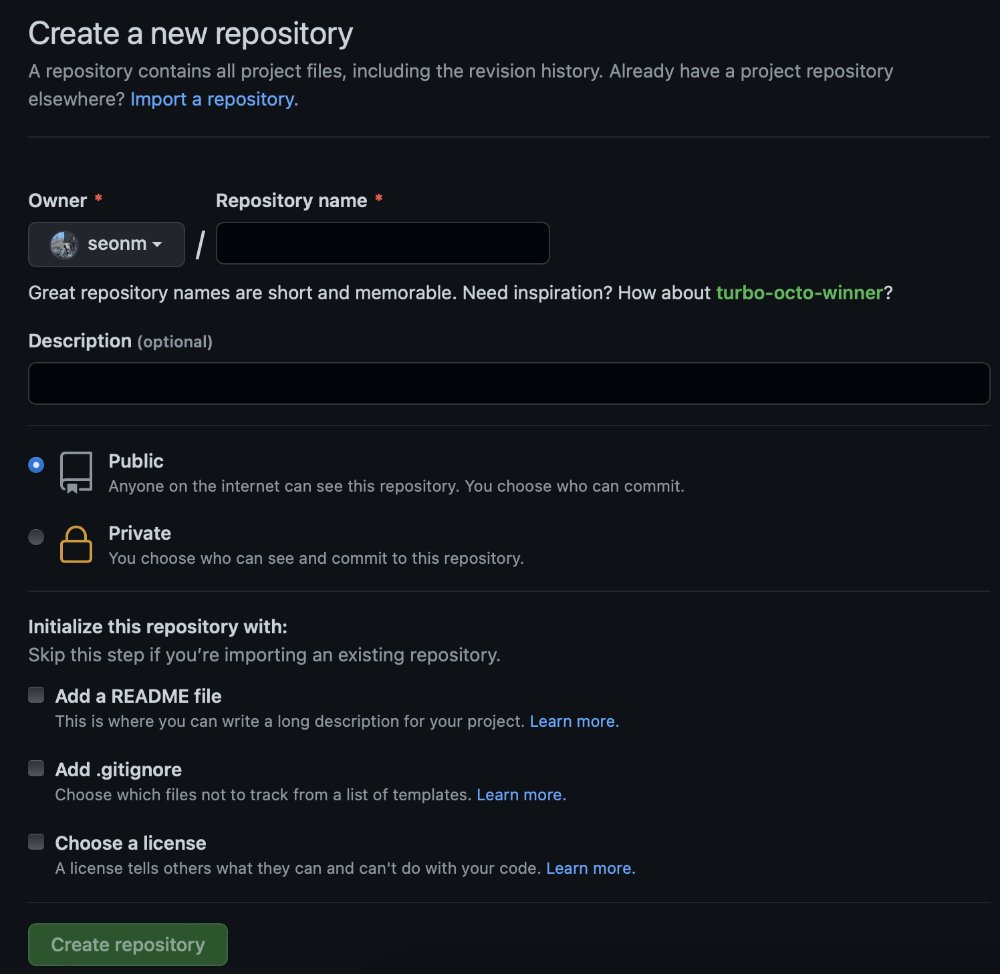
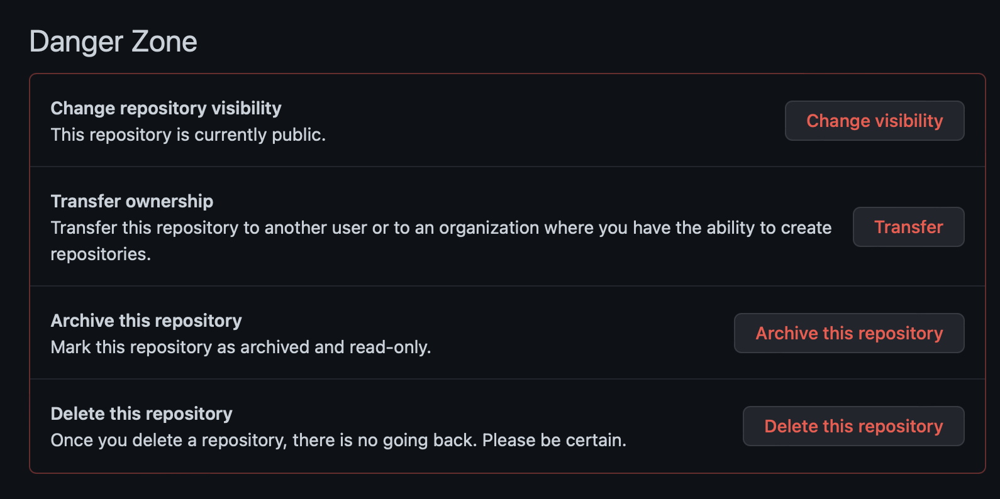

# Git 설치
## 목차
- [Git](#01-git)
- [Github](#02-github)
- [설치](#03-설치)
- [기본설정](#04-기본-설정)
---
## 01. Git
하나의 프로젝트를 작업시 여러 공동작업자들이 동시에 작업을 진행 및 작업물을 형상관리해주는 분산 버전 관리 시스템

## 02. Github
- 웹상에서 제공하는 서비스 중 보편적으로 발전한 것  
  - 발전 CVS > SVN > Git
- 조별 과제 활동시 작업결과물을 취합하기 위한 웹하드
- 소스코드 자동 merge
- 형상관리 : 소프트웨어의 변경사항을 체계적으로 추적하고 통제하는 것
- https://github.com

## 03. 설치
### Windows
https://git-scm.com/
### Mac
xcode설치시 git이 자동으로 설치된다.  
`$ xcode-select --install`
  
## 04. 기본 설정
- 이름  
  git config --global user.name 'yourName'  
- 이메일  
  git config --global user.email 'yourEmail'  
- 한글안깨지게  
  git config --global core.precomposeunicode true  
  git config --global core.quotepath false

- 로그인 확인 명령어  
  git config --list

## 05. repository 

repository > setting > danger zone

