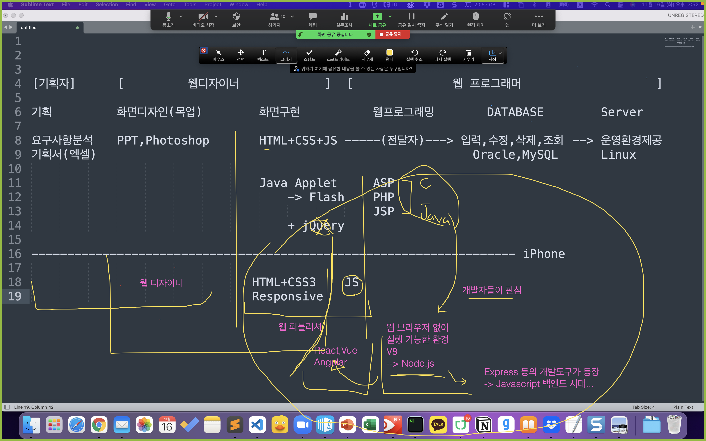
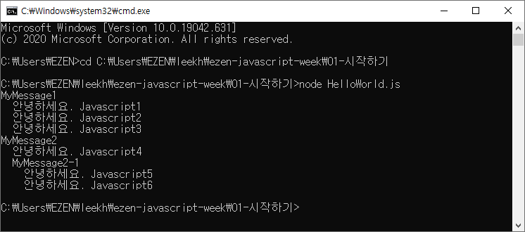
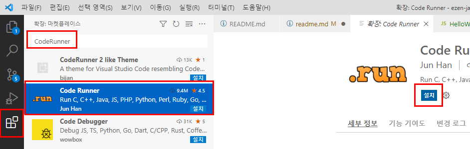
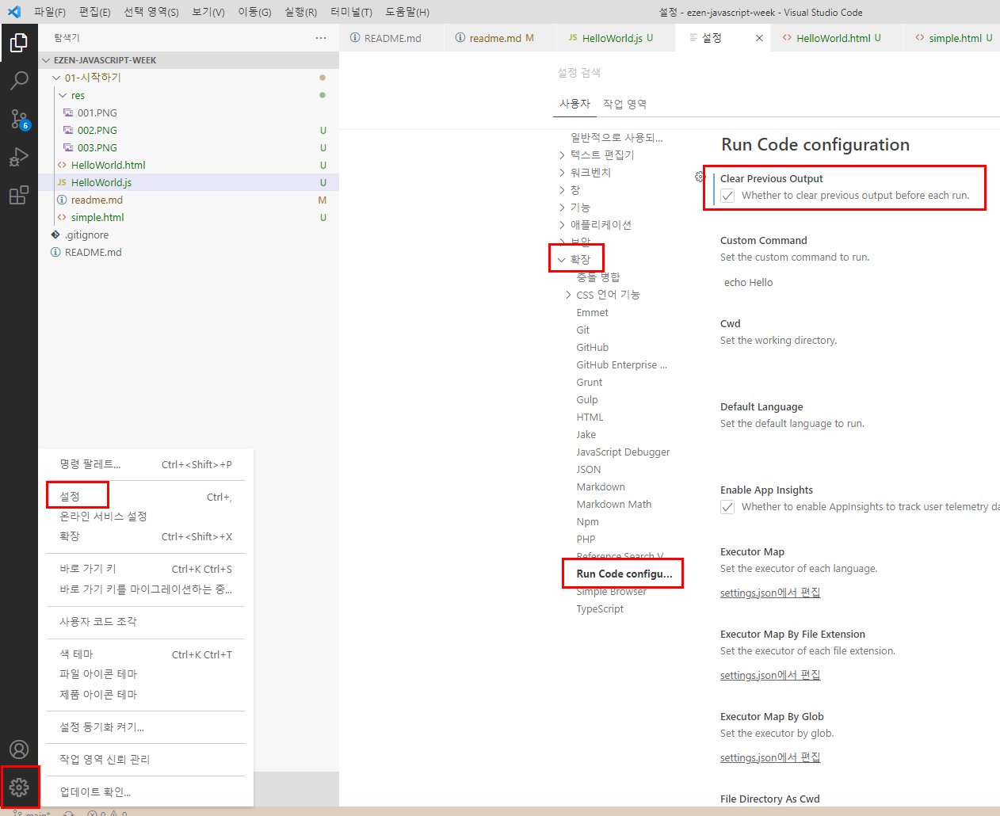

# Hello Javascript

## #01. 웹 사이트 관련 직군 / 언어 분류



## #02. 실행환경 구성

### 1) Node.js

#### 설치확인

윈도우의 경우 명령프롬프트 실행

> WinKey + R > cmd (엔터)

맥의 경우 터미널 실행

> Cmd + Space > 터미널 검색

명령어 수행

```shell
node --version
```

결과값이 출력되지 않을 경우 https://nodejs.org 에서 프로그램 내려받아 설치 필요함.

대부분의 경우 LTS 버전 권장.

Mac M1 버전의 경우 17.1 이상 버전 필요함.

설치 완료 후 열어두었던 명령프롬프트나 터미널을 종료하고 재시작.

앞서 수행한 버전확인 명령어를 통해 설치 완료 확인.


### 2) Visual Studio Code

https://code.visualstudio.com/


## #03. Hello Javascript

### 1) 소스코드

프로그램 명령어를 저장해 놓은 파일

사용하는 프로그래밍 언어에 따라 확장자가 서로 다르다. (`*.java`, `*.js`, `*.py`, `*.cpp`)

일반적인 메모장용 텍스트파일의 확장자를 강제로 수정해서 사용한다.

### 2) 주석문

프로그램 소스코드 안에 명시하는 필기.

소스코드에 대한 부연 설명을 작성하는 용도.

#### 한 줄 전용

`//` 를 명시하고 그 뒤에 주석 내용을 작성한다. 여러 줄을 지정해야 할 경우 모든 행 앞에 `//`가 붙는다.


```javascript
// 여기는 주석입니다.
// 여기는 주석입니다.
// 여기는 주석입니다.
// 여기는 주석입니다.
```

#### 여러줄 처리

`/*`과 `*/` 사이에 주석 내용을 작성한다. 이 안에서는 줄바꿈이 자유롭다.

```javascript
/*
여기는 주석입니다.
여기는 주석입니다.
여기는 주석입니다.
여기는 주석입니다.
*/
```

### 3) 첫 번째 Javascript program

#### JS가 HTML안에 존재하는 경우.

원래 JS는 HTML에 기생하는 존재.

> simple.html


#### JS코드와 HTML을 분리

하나의 파일에 HTML(뼈대) + CSS(옷) + JS(동작)가 혼합되면서 코드가 복잡해지고 길어진다. (스파게티 코드)

CSS와 JS를 별도의 파일로 분리하는 것이 바람직.

##### 확장자가 `*.js`인 파일이 순수 JS코드만 작성

> HelloWorld.js

##### JS파일을 참조하는 HTML

> HelloWorld.html


### 4) JS 소스코드 작성시 주의 사항

1. 대소문자를 업격히 구분한다.
2. 줄바꿈과 띄어쓰기는 개발자가 코드를 읽기 수월하게 하기 위한 용도일 뿐 실행에는 아무런 영향이 없다.


### 5) JS 파일 직접 실행

#### 명령프롬프트(win)를 통한 실행

- `WinKey+R` -> cmd `(엔터)` 로 명령프롬프트 실행
- 소스파일이 존재하는 폴더로 이동 `cd 폴더경로`
    - 폴더 위치가 C드라이브가 아닌 경우 `/d` 옵션 적용 -> `cd /d 폴더경로`
- `node 파일이름` 명령으로 코드 실행



#### VSCode를 통한 실행

- `Code Runner` 확장 익스텐션 설치



- 코드 창에서 `Ctrl + Alt + N` 으로 실행
- 원하는 부분만 드래그 후 부분 실행 가능함.

##### 실행시 이전 출력 내용 삭제 설정



## #04. 프로그램 소스코드가 실행되는 과정

### 1) 컴파일 언어
반드시 기계어로 컴파일되어야만 실행시킬 수 있는 프로그래밍언어
1. 개발자가 프로그램 소스코드를 작성
2. 작성한 소스코드를 2진수(바이너리, 기계어)형태로 변환 > 컴파일(compile)
   - 소스코드를 컴파일 해 주는 소프트웨어 > 컴파일러(compiler)
3. 컴파일 된 바이너리를 시행한다.
   - 한번 컴파일된 파일은 2진수 형태로 저장되어 있기때문에 재실행시 컴퓨터가 해석할 필요가 없다.
   - 컴파일된 결과물은 독립 실행이 가능한 형태기 때문에 별다른 도구가 필요 없다.

> C, C++, Java 등

### 2) 인터프리터 언어

컴파일러를 거쳐서 기계어로 변환되지 않고 바로 실행되는 프로그래밍 언어
1. 컴파일을 거치지 않고 매 실행시마다 소스코드를 해석하는 과정이 반복적으로 수행되는 형태
2. 컴파일을 하지 않는다는 간편함 때문에 상대적으로 배우기 쉽다.
3. 컴파일 언어보다는 실행속도가 느리다.
   - 대용량 서비스에 적용하는 것은 적합하지 않다.
4. 컴파일을 하지 않는 대신 실행을 하기위해 해석기가 매번 필요하다.
   - Javascript 코드는 실행하기 위해서 반드시 Node나 웹브라우저가 필요하다.

> javascript, Python

- 컴파일 언어 : 선언시 데이터 타입 명시 `ex` int a;
- 인터프리터 언어 : 할당하는 값에따라 데이터n타입이 나중에 결정됨. 선언시 대부분 키워드만 잡음 `ex` var a;


#### 스크립트 언어
인터프리텅 방식에서 사용하기 위해 고안된 프로그래밍 언어

0
1
컴퓨터에서 계산이 이루어지는거는 메모리가 어떤값을 기록할 수있기때문에 가능한 것
반도체 원판의 사이즈는 항상 동일, 얼마나 자잘하게 쪼개는지가 메모리 성능 결정
메모리의 범위는 굉장히 크다.
> 하드디스크, usb, ram  

도체 : 전류가 흐르는 물체  
부도체 : 전류가 흐르지 않는 물체  
반도체 : 열이나 전기를 가해서 전기가 흐르거나 흐르지 않는 성질을 바꿀 수 있는 물체
전기 on > 1
전기 off > 0

## 인코딩(encoding), 캐릭터셋
글자를 표현하기 위한 2진수의 조합 방법

### 컴퓨터 단위
2진수 1개 = 1bit = 2개의 정보 표현 (0, 1)  
2 bit = 4개의 정보 표현 (00,01,10,11)  
3 bit = 8개 정보 표현(000,001,010,100...)  
n bit = 2의 2제곱개의 정보

1024byte = 1Kbyte  
1024Kbyte = 1Mbyte  
1024Mbyte = 1Gbyte  
1024Gbyte = 1Tbyte  
1024Tbyte = 1Pbyte   


### ANSI 표현 방식
2진수를 조합해서 알파벳을 표현하려는 시도 
2진수 7개면 알파벳 표현 가능
### 확장 ANSI 
ANSI + 부호를 위한 1bit (총 8bit) > 영어 + 1개 국어 표현 가능
국제표준으로 채택
컴퓨터의 최소 용량 단위 1byte = 8bit 로 정의됨

영어, 숫자, 특수문자 > 1byte = 한 글자
한글, 한자 등의 조합형 문자 > 2byte = 한 글자

총 2개 국어 표현가능

### UTF-8
다국어를 한번에 표현하기 위해 언어를 구분하지 않고 3byte로 한글자로 표현
3byte = 24bit = 한글자

### 숫자
숫자 정수 4byte = 32bit = 숫자 한개 ex. 1, 365 상관없이 4byte  
표현가능범위 2천 2백 억 (220000000000)
overflow : 데이터가 표현 가능한 범위를 초과하여 맨 처음 값으로 회귀하는 현상


하나의 정보를 표현할 때 몇개씩 묶느냐에 따라 숫자 또는 문자로 나눠짐.

## 변수와 data type
### 변수란 ? 
메모리에 기록된 정보(2진수 집합)

정보를 어떻게 해석할 것인가를 정하는것 =data type


2진수 집합을 몇개씩 묶어서 해석할지를 결정하는 것
정보를 어떻게 해석할 것인가를 정하는것 
 > data type = 변수의 자료형 = data형

### Data type
String 문장  
Number 숫자, 정수, 실수 포함  
Boolean 논리(참/거짓)  
Object 복합정보, 객체  
   - Null
   - Array 배열
   - json
   - function...  

Undefined(빈 깡통, 주어진 데이터가 없음)

1. 변수의 선언  
   명령어를 사용해서 메모리의 특정 위치에 이름표를 붙임  
   ex. var a;
2. 변수의 할당  
   선언된 변수에 값을 대입  
   ex. a = 100;
   새로운 값이 할당 될때는 기존에 기록을 지우고 위에 덮어써짐
3. RAM : Random Access Memory  
   랜덤하게 엑세스하는 메모리  
   처리 속도가 빠르다.  
   휘발성(전원off시 데이터 날아감)  
4. HDD  
   처리 속도가 램보다 느림  
   비휘발성(영구 저장)

```javascript

```
