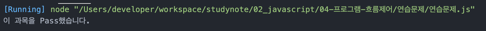

# 정선미 프로그램 흐름제어 과제
> 2022-01-26

## 문제1
아래의 'switch문'을 'if문'으로 재작성하시오

```javascript
const 수학 = 'B';

switch(수학) {
    case 'A':
    case 'B':
    case 'C':
        console.log('이 과목을 Pass했습니다.');
        break;
    default :
        console.log('이 과목을 Pass하지 못했습니다.');
        break
}
```

```javascript
const math = 'B';

if(math == 'A'|| math == 'B' || math == 'C'){
    console.log('이 과목을 Pass했습니다.')
} else{
    console.log('이 과목을 Pass하지 못했습니다.');
}
```
