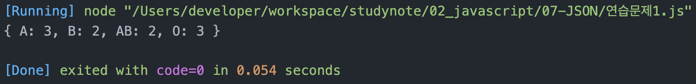
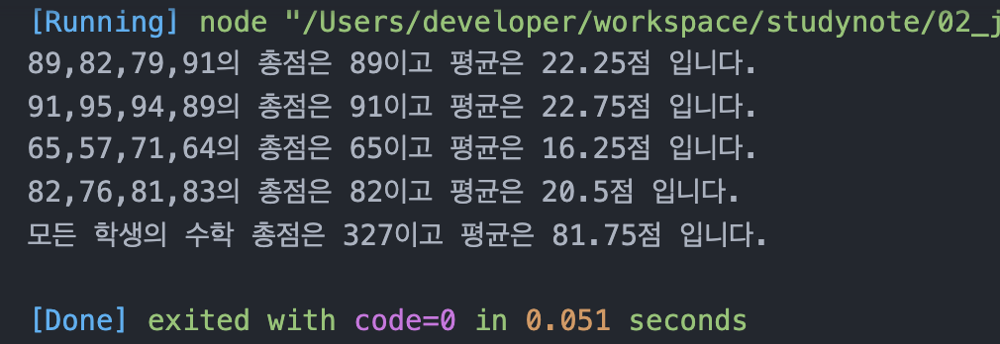
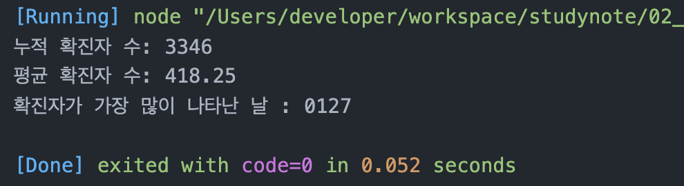

# 정선미 JSON 연습문제
> 2022-02-27

## 문제1.

다음은 10명의 학생들에 대한 혈액형 데이터이다.

```
['A', 'A', 'A', 'O', 'B', 'B', 'O', 'AB', 'AB', 'O']
```

아래와 같은 JSON을 정의하고, 각 혈액형별 학생수를 아래의 json의 각 key에 대한 value에 저장하시오. (혈액형별 학생 수를 for문을 활용하여 산출해야 합니다.)

```js
const result = {"A" : 0, "B" : 0, "AB" : 0, "O" : 0}
const bloods = ['A', 'A', 'A', 'O', 'B', 'B', 'O', 'AB', 'AB', 'O']

for(const blood of bloods){
  if(blood == 'A'){
    result.A++
  }else if(blood == 'B'){
    result.B++
  }else if(blood == 'AB'){
    result.AB++
  }else{
    result.O++
  }
}
console.log(result)

```

---

## 문제2.

다음의 JSON은 어느 학급의 중간고사 성적을 나타낸다.

```js
const exam = {
    "철수": [89, 82, 79, 91],
    "민영": [91, 95, 94, 89],
    "남철": [65, 57, 71, 64],
    "혜진": [82, 76, 81, 83]
}
```

### 2-1.

위 데이터에서 학생별 총점과 평균을 구하시오.

#### 출력결과

```
철수의 총점은 341점 이고 평균은 85.25점 입니다.
민영의 총점은 369점 이고 평균은 92.25점 입니다.
남철의 총점은 257점 이고 평균은 64.25점 입니다.
혜진의 총점은 322점 이고 평균은 80.5점 입니다.
```

### 2-2.

위 문제의 점수가 순서대로 국어, 영어, 수학, 과학일 경우 수학에 대한 모든 학생의 총점과 평균을 구하시오.

#### 출력결과

```
모든 학생의 수학 총점은 325점 이고 평균은 81.25점 입니다.
```

```js
const exam = {
  "철수": [89, 82, 79, 91],
  "민영": [91, 95, 94, 89],
  "남철": [65, 57, 71, 64],
  "혜진": [82, 76, 81, 83]
}

let sumMath = 0;
let avgMath = 0;

for(let i in exam){

  let sum = 0;
  let avg = 0;
  //console.log(exam[i])
  for(let j = 0; j < exam[i].length; j++){
    sum += exam[i][j]

    if(j = 3){
      sumMath += exam[i][j]
    }
    
  }
  avg = sum / exam[i].length
  console.log(exam[i] + '의 총점은 ' + sum + '이고 평균은 '+ avg+ '점 입니다.')
}

people = Object.getOwnPropertyNames(exam).length

avgMath = sumMath / people;

console.log('모든 학생의 수학 총점은 ' + sumMath +'이고 평균은 '+ avgMath + '점 입니다.' )

```


---

## 문제3.

아래의 데이터는 2021년 01월 25일부터 02월 01일까지의 Covid19 일별 확진자 수를 표현한 자료구조다.

```javascript
covid19 = [
    {date: '0125': active: 426}, 
    {date: '0126': active: 343}, 
    {date: '0127': active: 547}, 
    {date: '0128': active: 490}, 
    {date: '0129': active: 460}, 
    {date: '0130': active: 443}, 
    {date: '0131': active: 338}, 
    {date: '0201': active: 299}
]
```

### 3-1.

1월 25일부터 2월 1일까지의 누적 확진자 수와 일 평균 확진자 수를 구하시오.

#### 출력결과

```
누적 확진자 수: 3346
평균 확진자 수: 418.25
```


### 3-2

1월 25일부터 2월 1일까지 중에서 확진자가 가장 많이 나타난 날짜는 언제인가?

#### 출력결과

```
확진자가 가장 많이 나타난 날: 0127
```


```js
covid19 = [
  {date: '0125', active: 426}, 
  {date: '0126', active: 343}, 
  {date: '0127', active: 547}, 
  {date: '0128', active: 490}, 
  {date: '0129', active: 460}, 
  {date: '0130', active: 443}, 
  {date: '0131', active: 338}, 
  {date: '0201', active: 299}
]
let sum = 0;
let avg = 0;

let max = covid19[0]['active']
let date = max.date

for(let i in covid19){
  //console.log(covid19[i]['active'])
  sum += covid19[i]['active']

  if(max < covid19[i]['active']){
    max = covid19[i]
  }

}
avg = sum / covid19.length
console.log('누적 확진자 수: '+ sum + '\n평균 확진자 수: '+ avg)
console.log('확진자가 가장 많이 나타난 날 : '+ max['date'])

```

