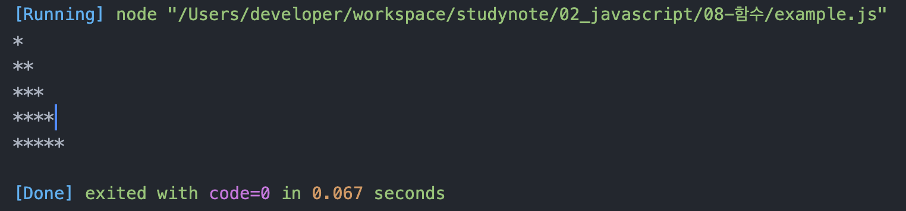

# 정선미 함수 연습문제
> 2022-02-07
## 문제1.

아래의 형태로 출력하는 함수를 구현하시오.

```js
// max는 출력해야 할 최대 라인 수
function printStar(max) {
  for(let i = 0; i < max; i++){
    let star = ''
    for(let j = 0; j < i+1; j++){
      star += '*'
    }
    console.log(star)
  }
}

printStar(5)

```

#### 출력결과

```
*
**
***
****
*****
```

## 문제2.

1번 문제를 응용하여 같은 파라미터를 받았을 때 별을 역으로 출력하는 `printRevStar(max)` 을 구현하시오.


#### 출력결과

```
*****
****
***
**
*
```
```js
function printRevStar(max) {
  for(let i = 0; i < max; i++){
    let star = ''
    for(let j = 0; j < max-i; j++){
      star += '*'
    }
    console.log(star)
  }
}

printRevStar(5)
```


## 문제3

369게임은 숫자를 순서대로 말하면서 3,6,9가 포함된 횟수만큼 박수를 치는 게임이다.

1부터 파라미터로 전달된 숫자까지 반복하면서 박수를 칠 조건이 충족되면 3,6,9 게임 규칙에 따라 박수를 의미하는 "짝"을 출력하고 그렇지 않은 경우에는 숫자를 출력하고, 박수를 총 몇번 쳤는지를 리턴하는 함수 `myGame(n)`을 작성하시오.

힌트: 문자열은 그 자체가 배열로 인식됩니다.

ex)
```js
const str = "Hello";
console.log(str[0]); // --> H
console.log(str[1]); // --> e
console.log(str[2]); // --> l
```

#### 출력예시

myGame(35)를 호출한 경우

```
1
2
짝(3) --> 1번
4
5
짝(6) --> 1번
7
8
짝(9) --> 1번
10
11
12
짝(13) --> 1번
14
15
...
짝(29) --> 1번
짝(30) --> 1번
짝(31) --> 1번
짝(32) --> 1번
짝짝(33) --> 2번
짝(34) --> 1번
짝(35) --> 1번

박수를 총 OO번 쳤습니다.
...

```
```js
//오답
function myGame(n){
  let num = 0;
  const str = '369'
  for(let i = 1; i < n; i++){
    i = i+ '';
    if(i == str[0] || i == str[1] || i == str[2]){
      console.log(`짝(${i})`)
      num++
    }else{
      console.log(i)
    }
  }
  console.log(`박수를 총 ${num}번 쳤습니다.`)
}
myGame(35)
```

> 풀이메모
```js

function myGame(n){

  // 박수를 총 몇번 쳤는지에 대한 합계값
  let count = 0;

  for(let i=1; i<=n; i++){
    // 현재숫자 i를 문자열로 변환해야한다. 33 > "33"
    // 문자열은 그 자체가 배열이므로 각 자리의 숫자를 의미하는 글자를 원소로 갖는 배열이 된다.
    const str = i + '' // 빈 문자열을 더해서 숫자를 문자로 바꾸기
    
    // 출력할 문자열 (숫자인지 박수소리인지)
    let say = '';
    // 이번 턴에 박수를 몇번 치는지 카운트 하는 변수
    let clap = 0;

    // 숫자를 문자열로 변환하여 각 글자수 만큼 반복
    for(let j of str){
      // console.log(j)
      if(j == '3' || j == '6' || j == '9'){
        say += '짝';
        clap++;
      }
    }
    
    if(clap == 0){
      console.log(i);
    } else{
      console.log('%s(%d) --> %d', say, i, clap);
      count += clap;
    }

  }

  console.log('박수를 총 %d번 쳤습니다.', count)
}

myGame(35)
```

## 문제4

문제1번을 재귀함수 기법으로 다시 구현해 보세요.

``` js
// max는 최대 행 수, current는 현재 출력중인 행의 위치
function printStar(max, current=1) {
  let star = ''
  if(max < current){
    return
  }else{
    for(let j = 0; j <= max - current; j++){
      star += '*'
    }
    current++
    printStar(max, current)
  }
  console.log(star)
}

printStar(5);
```
## 문제5 

문제2번을 재귀함수 기법으로 다시 구현해 보세요.

```js
// max는 최대 행 수, current는 현재 출력중인 행의 위치
function printRevStar(max, current=1) {
  let star = ''
  if(max < current){
    return
  }else{
    for(let j = 0; j <= current-1; j++){
      star += '*'
    }
    current++
    printRevStar(max, current)
  }
  console.log(star)
}

printRevStar(5);
```