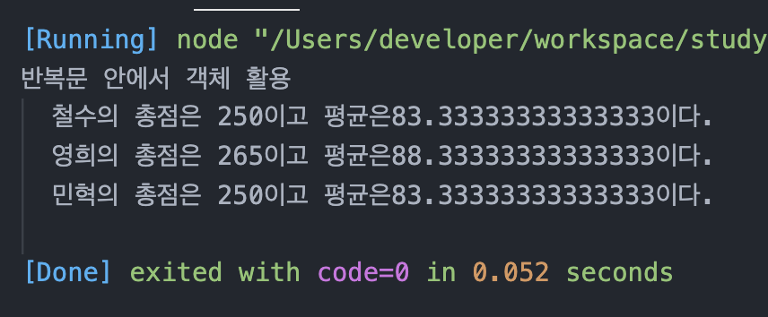
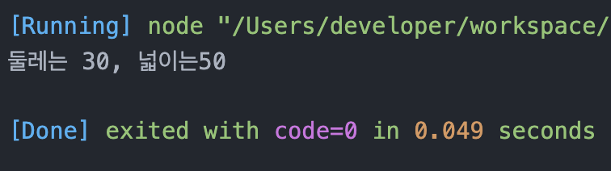

# 정선미 프로토타입 연습문제
> 2022-02-09

## 문제1. 

국어, 영어, 수학 점수를 생성자 파라미터로 입력받아서 합계와 평균을 구하는 클래스 Student를 작성하시오.

이 때 Stuent 클래스는 합계를 리턴하는 메서드인 `sum()`과 평균을 리턴하는 `avg()`를 제공합니다.

작성된 클래스를 활용하여 아래 표에 대한 학생별 합계 점수와 평균점수를 출력하시오.

클래스는 JSON 형식으로 작성되어야 합니다.

| 이름 | 국어 | 영어 | 수학 |
|---|---|---|---|
| 철수 | 92 | 81 | 77 |
| 영희 | 72 | 95 | 98 |
| 민혁 | 80 | 86 | 84 |


#### 출력결과

```
철수의 총점은 249점 이고 평균은 83점 입니다.
영희의 총점은 251점 이고 평균은 83.66666666666667점 입니다.
민혁의 총점은 264점 이고 평균은 88점 입니다.
```

```javascript
function Student(name, kor, eng, math){
  this._name = name;
  this._kor = kor;
  this._eng = eng;
  this._math = math;
}

Student.prototype = {
  get name(){
    return this._name;
  },
  set name(namePara){
    this._name = namePara;
  },
  get kor(){
    return this._kor;
  },
  set kor(korPara){
    this._kor = korPara;
  },
  get eng(){
    return this._eng;
  },
  set eng(engPara){
    this._eng = engPara;
  },
  get math(){
    return this._math;
  },
  set math(mathPara){
    this._math = mathPara;
  },
  sum: function(){
    let sum = this.kor + this.eng + this.math;
    return sum
  },
  avg: function(){
   let avg = (this.kor + this.eng + this.math) / 3;
   return avg
  }
}
const member1 = new Student('철수', 92, 81, 77);
const member2 = new Student('영희', 72, 95, 98);
const member3 = new Student('민혁', 80, 86, 84);

console.log(`${member1.name}의 총점은 ${member1.sum()}이고 평균은 ${member1.avg()}이다.`);
console.log(`${member2.name}의 총점은 ${member2.sum()}이고 평균은 ${member2.avg()}이다.`);
console.log(`${member3.name}의 총점은 ${member3.sum()}이고 평균은 ${member3.avg()}이다.`);
```

## 문제2.

가로(`width`), 세로(`height`)정보를 getter, setter로 관리하는 Rectangle 클래스를 정의하시오.

이 클래스는 생성자의 파라미터가 없으며 둘레의 길이를 구해 리턴하는 getAround() 메서드와 넓이를 구해 리턴하는 gerArea() 메서드를 제공합니다.

클래스는 JSON 형식으로 작성되어야 합니다.


#### 출력결과

가로가 10이고 세로가 5인 경우

```
둘레의 길이는 30이고 넓이는 50입니다.
```

```js
function Rectangle(width, height){
  this._width = width;
  this._height = height;
}
Rectangle.prototype = {
  get width(){
    return this._width;
  },
  set width(para){
    this._width = para;
  },
  get height(){
    return this._height;
  },
  set height(para){
    this._height = para;
  },
  getAround: function(){
    return (this.width + this.height) * 2
  },
  getArea: function(){
    return this.width * this.height
  }
}

const rectangle1 = new Rectangle(10,5);
console.log(`둘레는 ${rectangle1.getAround()}, 넓이는${rectangle1.getArea()}` )
```
