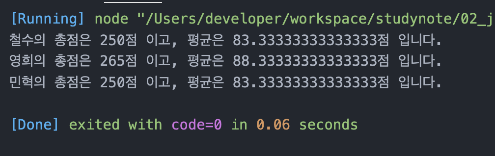
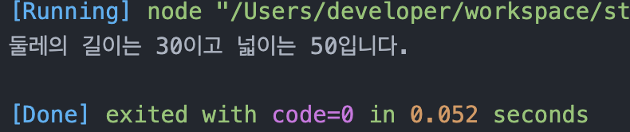

# 정선미 Class 기반 객체지향 연습문제
>2022-02-09
## 문제1.

앞 단원에서 수행한 연습문제 1,2번을 Class 기반의 객체지행으로 재구성하시오.

## 문제1-1. 

```javascript
class Student{
  constructor(kor, eng, math){
    this._kor = kor;
    this._eng = eng;
    this._math = math;
  }
  sum(){
    return this._kor + this._eng + this._math
  }
  avg(){
    return this.sum() / 3
  }
}

const grade = [
  ['철수', 92, 81, 77],
  ['영희', 72, 95, 98],
  ['민혁', 80, 86, 84]
];
for(const line of grade){
  const gradePerson = new Student(line[1],line[2],line[3]);
  console.log(`${line[0]}의 총점은 ${gradePerson.sum()}점 이고, 평균은 ${gradePerson.avg()}점 입니다.`)
}

```


## 문제 1-2.

```js
class Rectangle{
  constructor(width, height){
    this._width = width;
    this._height = height;
  }
  set width(value){
    this._width = value
  }
  get width(){
    return this._width
  }
  set height(value){
    this._height = value
  }
  get height(){
    return this._height
  }
  getAround(){
    if(!this._width || !this._height){
      '값을 입력하세요.'
    }
    return (this._width + this._height) * 2;
  }
  getArea(){
    if(!this._width || !this._height){
      '값을 입력하세요.'
    }
    return this._width * this._height;
  }
}
const ara = new Rectangle(10,5);
console.log(`둘레의 길이는 ${ara.getAround()}이고 넓이는 ${ara.getArea()}입니다.`);
```
