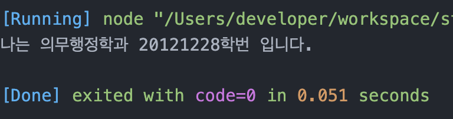
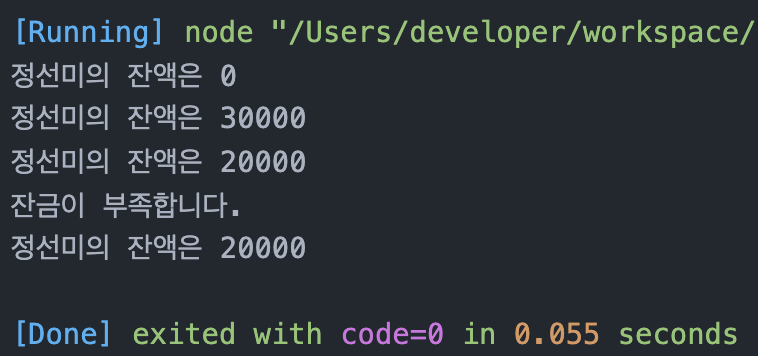

# 정선미 Class 기반 객체지향 연습문제
>2022-02-10

## 문제2
다음을 만족하는 Student 클래스를 작성하시오.

1. String형의 학과와 정수형의 학번을 프로퍼티로로 선언후 생성자를 통해 주입
2. getter, setter를 정의
3. sayHello() 메서드를 통해 "나는 OOOO학과 OO학번 입니다." 를 출력하는 기능을 구현

```js

class Student{
  constructor(subject, num){
    this._subject = subject;
    this._num = num;
  }
  set subject(value){
    this._subject = value;
  }
  get subject() {
    return this._subject
  }
  set num(value){
    this._num = value;
  }
  get num() {
    return this._num
  }
  sayHello(){
    return `나는 ${this._subject}학과 ${this._num}학번 입니다.`
  }
}
const jeong = new Student('의무행정',20121228);
console.log(jeong.sayHello())

```


## 문제3.
다음을 만족하는 클래스 Account를 작성하시오.(틀린문제)

1. 다음의 2 개의 필드를 선언
    - 문자열 owner; (이름)
    - 숫자형 balance; (금액)
1. 위 모든 필드에 대한 getter와 setter의 구현
1. 위 모든 필드를 사용하는 가능한 모든 생성자의 구현
1. 메소드 deposit()의 헤드는 다음과 같으며 인자인 금액을 저축하는 메소드
    - deposit(amount)
1. 메소드 withdraw()의 헤드는 다음과 같으며 인자인 금액을 인출(리턴)하는 메소드
    - withdraw(long amount)
    - 인출 상한 금액은 잔액까지로 하며, 이 경우 이러한 상황을 출력


```js

class Account{
  constructor(owner, balance){
    this._owner = owner;
    this._balance = balance;
  }
  set owner(value){
    this._owner = value;
  }
  get owner(){
    return this._owner;
  }
  set balance(value){
    this._balance = value;
  }
  get balance(){
    return this._balance;
  }
  /* 틀린부분
  deposit(amount){
   return amount = amount + this._balance
  }
  withdraw(long, amount){
    return long = this.deposit(amount).amount
  }*/

  //수정본
  deposit(amount){
    //계좌(balance)에 입금된 금액(amount)추가
    this.balance += amount
  }
  withdraw(amount){
    //잔액부족알림
    if(this.balance < amount){
      console.log('잔금이 부족합니다.')
      return
    }
    //계좌에서 출금된 금액 빼기
    this.balance -= amount
  }
}

const myaccount = new Account('정선미', 0);
/* 틀린부분
console.log(`저장된 금액은 ${myaccount.deposit(30000)}, 인출금액은 ${myaccount.withdraw(30000)}`)
*/

// 수정본
console.log(`${myaccount.owner}의 잔액은 ${myaccount.balance}`);

myaccount.deposit(30000);
console.log(`${myaccount.owner}의 잔액은 ${myaccount.balance}`);
myaccount.withdraw(10000);
console.log(`${myaccount.owner}의 잔액은 ${myaccount.balance}`);
myaccount.withdraw(100000);
console.log(`${myaccount.owner}의 잔액은 ${myaccount.balance}`);

```



