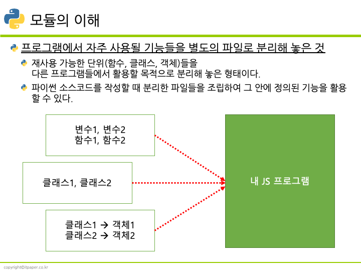

# 모듈

js소스파일로 클래스나 함수 형태로 작성되어 있다.
  - 클래스나 함수 안에서는 변수, 연산자, 조건문, 반복문, 배열, JSON등을 활용하여 연산결과를 반환한다.

모듈은 대개 클래스 하나 혹은 특정한 목적을 가진 복수의 함수로 구성된 라이브러리 하나로 구성

프로그램에서 자주 사용될 기능들을 별도의 파일로 분리해 놓은 것

필요시 참조해서 사용

모듈에 특수한 지시자 export와 import를 적용하면 다른 모듈을 불러와 불러온 모듈에 있는 함수를 호출하는 것과 같은 기능 공유가 가능합니다.

export 지시자를 변수나 함수 앞에 붙이면 외부 모듈에서 해당 변수나 함수에 접근할 수 있습니다(모듈 내보내기).
import 지시자를 사용하면 외부 모듈의 기능을 가져올 수 있습니다(모듈 가져오기).
