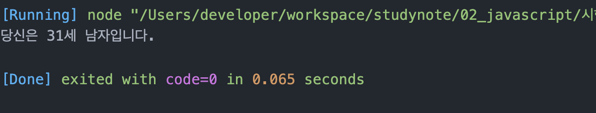
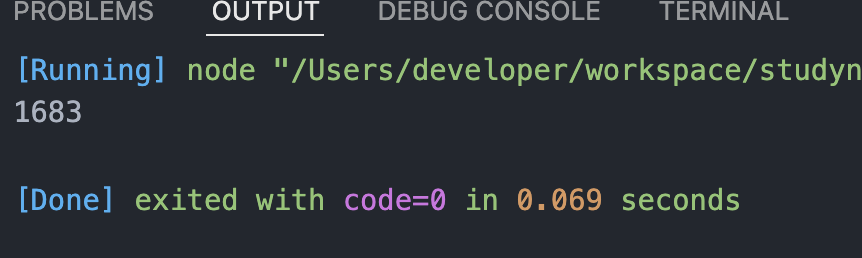
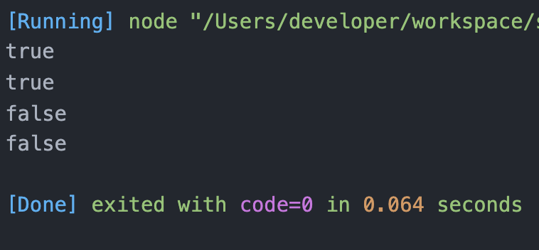
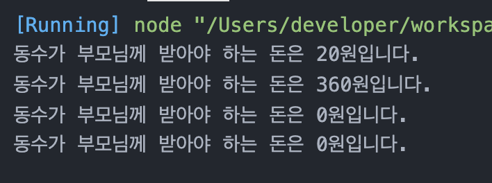
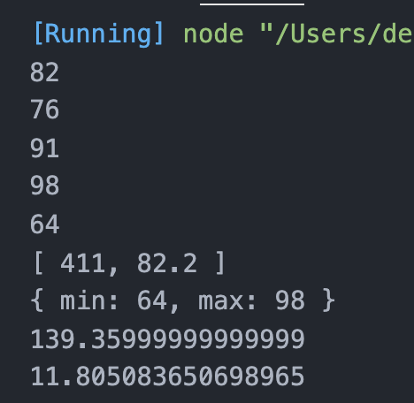

# 프로그래밍언어활용_정선미_산출물
> 2022-02-22
## 문제1
```js
const ssn = '9203211';
const ssnGender = ssn.substring(6,7);
const ssnYear = parseInt(ssn.substring(0,2));

const year = ssnGender == 1 || ssnGender == 2 ? ssnYear + 1900 : ssnYear + 2000;
const age = new Date().getFullYear() - year + 1;
const gender = ssnGender == 1 || ssnGender == 3 ? '남자' : '여자';
console.log(`당신은 ${age}세 ${gender}입니다.`)
```


## 문제2
```js
const number = 100;
let sum = 0;
for(let i=1; i<=number; i++){
  if(i%3 == 0){
    sum += i;
  }
}
console.log(sum)
```


## 문제3
```js

function solution(x){
  let strX = x.toString();
  let sum = 0;
  for(const i of strX){
    sum += Number(i);
  }
  if(x % sum === 0){
    return x = true;
  }else{
    return x = false;
  }
}
console.log(solution(10))
console.log(solution(12))
console.log(solution(11))
console.log(solution(13))
```


## 문제4
```js
function solution(K, N, M){
  const snackPrice = K * N;
  let parents = snackPrice - M;
  parents = parents > 0 ? parents : 0;
  return `동수가 부모님께 받아야 하는 돈은 ${parents}원입니다.`;
}
console.log(solution(30,4,100))
console.log(solution(250,2,140))
console.log(solution(20,6,120))
console.log(solution(20,10,320))
```


## 문제5
```js
class Student{
  constructor(){
    this._grade = new Array();
  }
  set score(value){
    this._grade.push(value);
  }
  getSum(){
    let sum = 0;
    if(this._grade.length > 0){
      for(const i of this._grade){
        sum+= i
      }
    };
    return sum
  }
  getAvg(){
    let avg = this.getSum() / this._grade.length;
    return avg
  }
  getSumAvg(){
    return [this.getSum(), this.getAvg()]
  }
  getMinMax(){
    let getMinMax = {
      min : this._grade[0],
      max : this._grade[0]
    }
    for(let i=0;i<this._grade.length;i++){
      getMinMax['max'] = this._grade[i] > getMinMax['max'] ? getMinMax['max'] = this._grade[i] : getMinMax['max'];
      getMinMax['min'] = this._grade[i] < getMinMax['min'] ? getMinMax['min'] = this._grade[i] : getMinMax['min'];
    }
    return getMinMax;
  }
  getVar(){
    //편차(개별값-평균값)를 제곱한 후 다 더해서 전체 자료의 수로 나누어 준 값
    let sumAvg = 0;
    for(const i of this._grade){
      sumAvg += ((i - this.getAvg()) * (i - this.getAvg()))
    }
    return sumAvg / this._grade.length
  }
  getStd(){
    return Math.sqrt(this.getVar())
  }
}

let a = new Student();

console.log(a.score = 82)
console.log(a.score = 76)
console.log(a.score = 91)
console.log(a.score = 98)
console.log(a.score = 64)

console.log(a.getSumAvg())
console.log(a.getMinMax())
console.log(a.getVar())
console.log(a.getStd())
```
