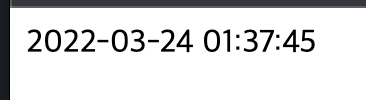
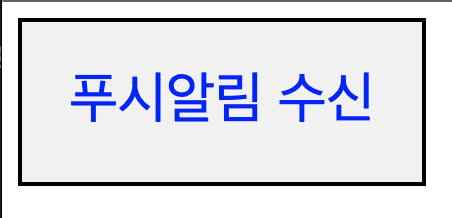
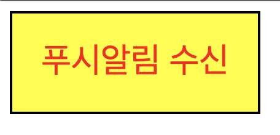
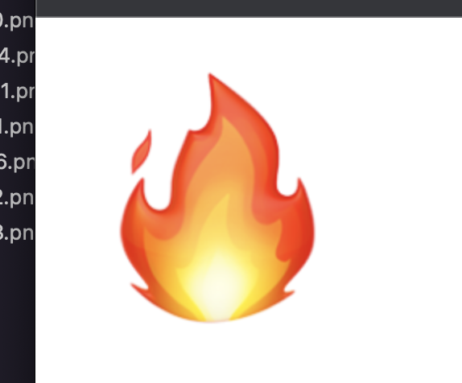
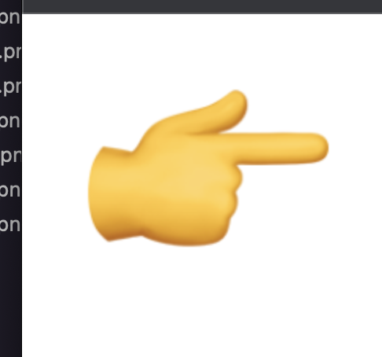
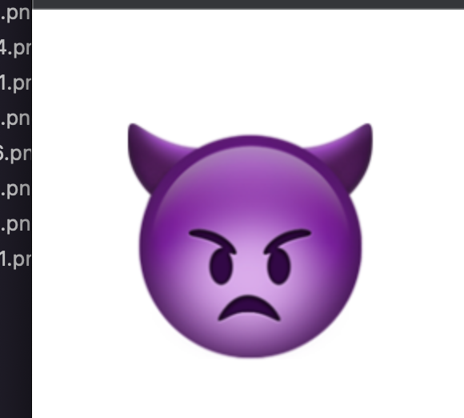
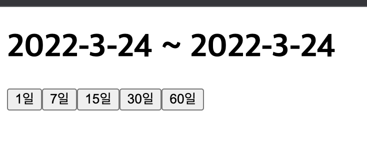
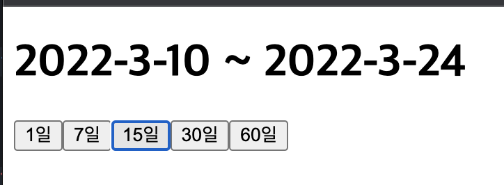

# 정선미 HTML제어하기 연습문제.md
> 2022.03.23
<style>
  img{width:50%}
</style>
## 문제1
```html
<!DOCTYPE html>
<html lang="ko">
<head>
  <meta charset="UTF-8">
  <meta http-equiv="X-UA-Compatible" content="IE=edge">
  <meta name="viewport" content="width=device-width, initial-scale=1.0">
  <title>Document</title>
  <style></style>
</head>
<body>
  <div id="date"></div>
  <script>
    function time(){
      const today = new Date();
      const year = today.getFullYear();
      const month = today.getMonth()>9 ? today.getMonth()+1:`0${today.getMonth()+1}`;
      const date = today.getDate()>10 ? today.getDate():`0${today.getDate()}`;
      const hours = today.getHours()>10 ? today.getHours():`0${today.getHours()}`;
      const minutes = today.getMinutes()>10 ? today.getMinutes():`0${today.getMinutes()}`;
      const seconds = today.getSeconds()>10 ? today.getSeconds():`0${today.getSeconds()}`;
      document.querySelector('#date').innerHTML = `${year}-${month}-${date} ${hours}:${minutes}:${seconds}`
    }
    function nowTime(){
      time();
      setInterval(time, 1000)
    }
    nowTime()
  </script>
</body>
</html>
```


## 문제2
```html
<!DOCTYPE html>
<html lang="ko">
<head>
  <meta charset="UTF-8">
  <meta http-equiv="X-UA-Compatible" content="IE=edge">
  <meta name="viewport" content="width=device-width, initial-scale=1.0">
  <title>Document</title>
  <style>
    .box{width:200px;height: 80px;border:2px solid #000;background: #f1f1f1;color: blue;text-align: center;line-height: 80px;font-size: 28px;}
    .box.on{background: yellow;color: red;}
  </style>
</head>
<body>
  <div class="box">푸시알림 수신</div>
  <script>
    const box = document.querySelector('.box')
    box.addEventListener('click',(e)=>{
      box.classList.toggle('on')
      
    })
  </script>
</body>
</html>
```



## 문제3
```html
<!DOCTYPE html>
<html lang="ko">
<head>
  <meta charset="UTF-8">
  <meta http-equiv="X-UA-Compatible" content="IE=edge">
  <meta name="viewport" content="width=device-width, initial-scale=1.0">
  <title>Document</title>
  <style>

  </style>
</head>
<body>
  
  <script>
    function imgIndex(){
      let i=2;
      setInterval(()=>{
        let srcI = './img/img' + i + '.png';
        document.getElementById('anyImg').src = srcI;
        console.log(srcI)
        i++;
        if(i > 3){
          i = 1;
        }
      }, 3000)
    }
    imgIndex()
  </script>
</body>
</html>
```




## 문제4
```html
<!DOCTYPE html>
<html lang="ko">
<head>
  <meta charset="UTF-8">
  <meta http-equiv="X-UA-Compatible" content="IE=edge">
  <meta name="viewport" content="width=device-width, initial-scale=1.0">
  <title>Document</title>
  <style>
    input{float: left;}
  </style>
</head>
<body>
  <h1 id="date">
    <span class="before"> </span> ~ <span class="now"> </span>
  </h1>
  <input id="btn1" type="button" value="1일">
  <input id="btn2" type="button" value="7일">
  <input id="btn3" type="button" value="15일">
  <input id="btn4" type="button" value="30일">
  <input id="btn5" type="button" value="60일">
</body>
<script>
  function btnDate(n){
    let now = new Date();
    let year = now.getFullYear();
    let month = now.getMonth()+1;
    let date = now.getDate();

    let before = new Date(now.setDate(now.getDate()-n));
    let bYear = before.getFullYear();
    let bMonth = before.getMonth()+1;
    let bDate = before.getDate()+1;
    document.querySelector('.before').innerHTML = `${bYear}-${bMonth}-${bDate}`
    document.querySelector('.now').innerHTML = `${year}-${month}-${date}`;
  }

  btnDate(1)
  
  document.querySelector('#btn1').addEventListener('click', () => btnDate(1));
  document.querySelector('#btn2').addEventListener('click', () => btnDate(7));
  document.querySelector('#btn3').addEventListener('click', () => btnDate(15));
  document.querySelector('#btn4').addEventListener('click', () => btnDate(30));
  document.querySelector('#btn5').addEventListener('click', () => btnDate(60));
</script>
  
</html>
```



