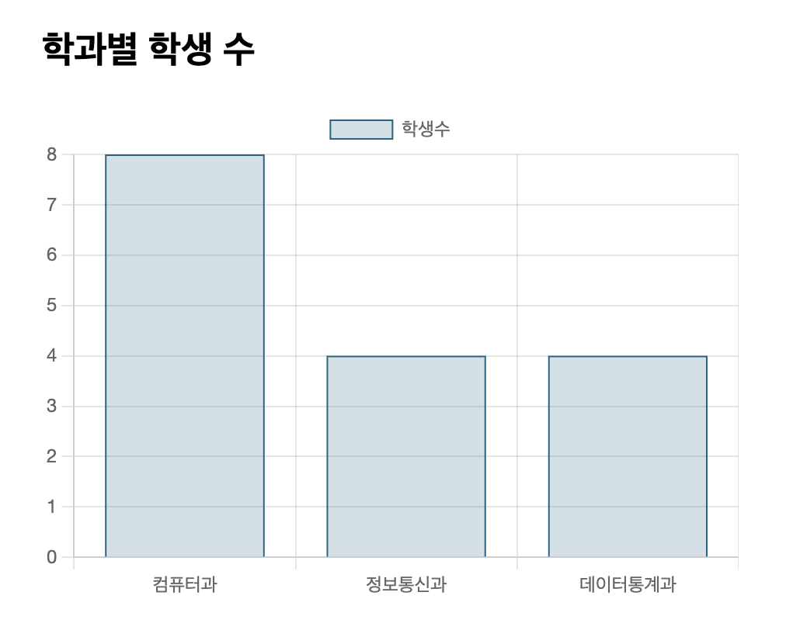
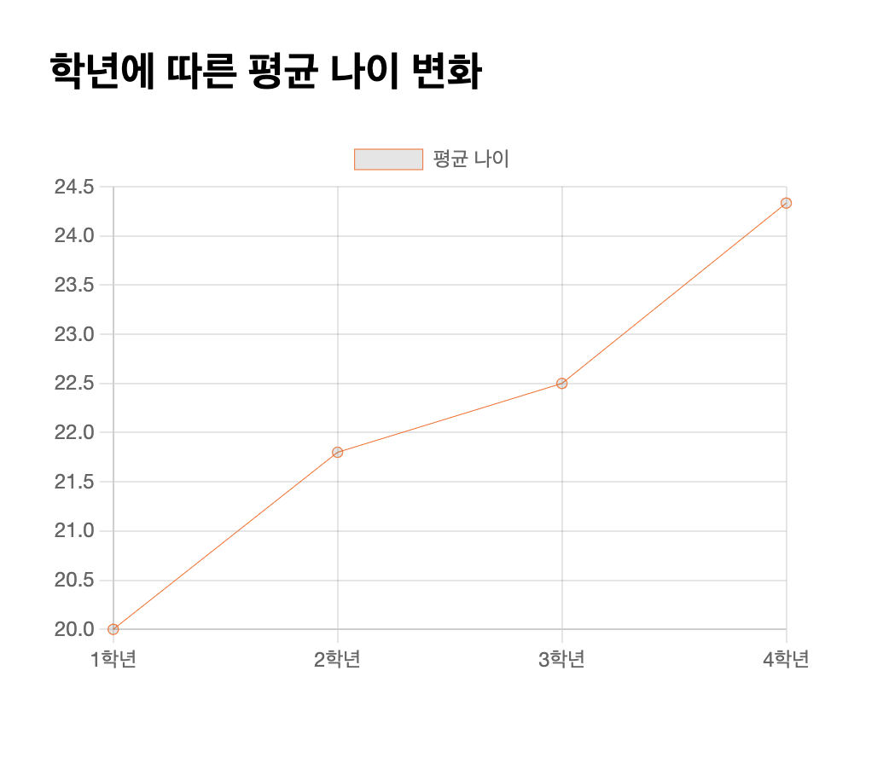
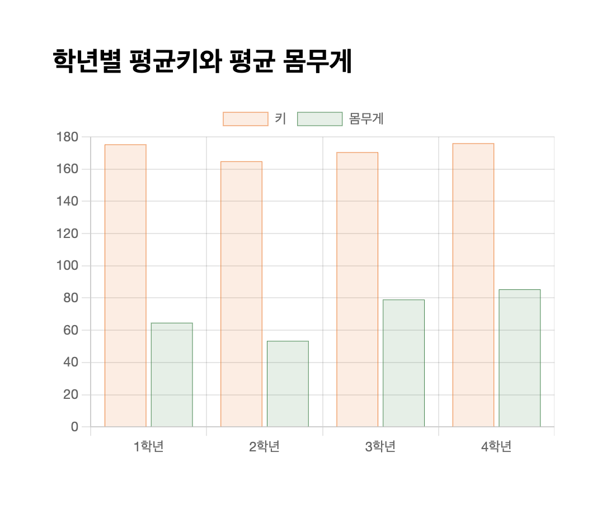

# 정선미 라이브러리 활용 chart.js 연습문제
> 2022-03-31

## 문제1
```html
<!DOCTYPE html>
<html lang="ko">
<head>
  <meta charset="UTF-8">
  <meta http-equiv="X-UA-Compatible" content="IE=edge">
  <meta name="viewport" content="width=device-width, initial-scale=1.0">
  <title>라이브러리 활용 chart.js 연습문제</title>
  <style>
    .subplot{
      width: 90%;padding: 5%;margin:0 auto; box-sizing: border-box;
    }
    .subplot-item{
      width: auto;height: 320px;
    }
  </style>
</head>
<body>
  <div class="subplot">
    <h2>학과별 학생 수</h2>
    <div class="subplot-item">
      <canvas id="mychart2"></canvas>
    </div>
  </div>

  <script src="https://cdn.jsdelivr.net/npm/chart.js"></script>
  <script type="text/javascript" src="dataset.js"></script>
  <script type="text/javascript">
    let depart =[] // 학과
    let department = [] // 필터링된 학과
    let studentCount = []

    // 학과데이터 가져오기
    for(let i=0;i<student.length;i++){
      // 중복 학과 필터링
      if(!department.includes(student[i].deptno)){
        department.push(student[i].deptno)
      }

      //count 구하기
      for(let j=0;j<department.length;j++){
        if(student[i].deptno == department[j] && studentCount[j] == undefined){
          studentCount[j] = 1;
        }else if(student[i].deptno == department[j]){
          studentCount[j] += 1
        }
      }
    }
    console.log(department, studentCount)


    const mychart2 = document.getElementById('mychart2');

    new Chart(mychart2, {
        type: 'bar',
        data: {
          labels : department,// 학과
          datasets : [
            {
              label:'학생수', // 데이터 이름
              data:studentCount, // 학생수
              borderWidth:1, 

              borderColor:'rgba(2,99,132,1)', 
              backgroundColor:'rgba(2,99,132,0.2)'
            }
          ]
        },

        options: {
          maintainAspectRatio:false,
          indexAxis:'x'
        }
      }
    );

  </script>
</body>
</html>
```


## 문제2
```html
<!DOCTYPE html>
<html lang="ko">
<head>
  <meta charset="UTF-8">
  <meta http-equiv="X-UA-Compatible" content="IE=edge">
  <meta name="viewport" content="width=device-width, initial-scale=1.0">
  <title>라이브러리 활용 chart.js 연습문제</title>
  <style>
    .subplot{
      width: 90%;padding: 5%;margin:0 auto; box-sizing: border-box;
    }
    .subplot-item{
      width: auto;height: 320px;
    }
  </style>
</head>
<body>
  <div class="subplot">
    <h2>학년에 따른 평균 나이 변화</h2>
    <div class="subplot-item">
      <canvas id="mychart2"></canvas>
    </div>
  </div>

  <script src="https://cdn.jsdelivr.net/npm/chart.js"></script>
  <script type="text/javascript" src="dataset.js"></script>
  <script type="text/javascript">
    let gradeArr = [];
    let info = {}

    // 학년 및 나이 가져오기
    for(let i=0;i<student.length;i++){
      // 학년 배열
      if(!gradeArr.includes(student[i]['grade'])){
        gradeArr.push(student[i]['grade'])
        info[student[i]['grade']+'학년'] = [];
      } 

      // 나이 배열
      const yy = new Date().getFullYear();
      const age = yy - Number(student[i].birthdate.slice(0,4)) + 1;

      info[student[i]['grade']+'학년'].push(age)
    }
    
    
    const ageInfo = {}
    Object.keys(info).sort().forEach(function(key) {
      ageInfo[key] = info[key];
    });

    let avg = [];
    for(const i in ageInfo){
      let sum = 0;
      for(let j=0;j<ageInfo[i].length;j++){
        sum += ageInfo[i][j]
      }
      console.log(sum)
      avg.push(sum/ageInfo[i].length)
    }
    const ageInfoKeys = Object.getOwnPropertyNames(ageInfo);
    
    console.log(ageInfo)
    
    const mychart1 = document.getElementById('mychart2');

    new Chart(mychart1, {
        type: 'line',
        
        data: {
          labels : ageInfoKeys,
          datasets : [
            {
              label:'평균 나이',
              data:avg,
              borderWidth:0.5, 
              borderColor:'#ff6600', 
            }
          ]
        },
        options: {
          maintainAspectRatio:false,
        }
      }
    );
  </script>
</body>
</html>
```


## 문제3
```html
<!DOCTYPE html>
<html lang="ko">
<head>
  <meta charset="UTF-8">
  <meta http-equiv="X-UA-Compatible" content="IE=edge">
  <meta name="viewport" content="width=device-width, initial-scale=1.0">
  <title>라이브러리 활용 chart.js 연습문제</title>
  <style>
    .subplot{
      width: 90%;padding: 5%;margin:0 auto; box-sizing: border-box;
    }
    .subplot-item{
      width: auto;height: 320px;
    }
  </style>
</head>
<body>
  <div class="subplot">
    <h2>학년별 평균키와 평균 몸무게</h2>
    <div class="subplot-item">
      <canvas id="mychart3"></canvas>
    </div>
  </div>

  <script src="https://cdn.jsdelivr.net/npm/chart.js"></script>
  <script type="text/javascript" src="dataset.js"></script>
  <script type="text/javascript">

    let bodyInfo = {
        '1학년' : {},
        '2학년' : {},
        '3학년' : {},
        '4학년' : {}
    }

    // 학년별 키평균을 모은 배열
    let avgHeightArr = []
    let avgWeightArr = []
    
    const bodyInfoKeys = Object.getOwnPropertyNames(bodyInfo);
    //학년별 키 및 몸무게 데이터 만들기 함수
    // @num : 학년
    function emptyArr(num){
      // 학년별 빈배열 만들기
      for(let i=0;i<student.length;i++){
        if(student[i]['grade'] == num ){
          bodyInfo[bodyInfoKeys[num-1]] = {'height': [],'weight': []}
        } 
      }
      // 빈배열에 height와 weight값 삽입
      for(let i=0;i<student.length;i++){
        if(student[i]['grade'] == num ){
          bodyInfo[bodyInfoKeys[num-1]].height.push(student[i]['height'])
          bodyInfo[bodyInfoKeys[num-1]].weight.push(student[i]['weight'])
        }
      }
      const grade = `${num}학년`
      const height = bodyInfo[grade]['height'];
      const weight = bodyInfo[grade]['weight'];
      let avgHeight = 0;
      let avgWeight = 0;
      for(const i of height){
        avgHeight += i
      }
      for(const i of weight){
        avgWeight += i
      }
      avgHeightArr.push(avgHeight /= height.length)
      avgWeightArr.push(avgWeight /= weight.length)
    }
    emptyArr(1);
    emptyArr(2);
    emptyArr(3);
    emptyArr(4);

    const mychart3 = document.getElementById('mychart3');

    new Chart(mychart3, {
        type: 'bar',
        data: {
          labels : bodyInfoKeys,
          datasets : [
            {
              label:'키', // 데이터 이름
              data:avgHeightArr, // 데이터 배열
              borderWidth:0.5, 
              borderColor:'#fa7400', 
              backgroundColor:'#fa740022', 
            },
            {
              label:'몸무게', 
              data:avgWeightArr, 
              borderWidth:0.5, 
              borderColor:'#1f8544', 
              backgroundColor:'#1f854422', 
            }
          ]
        },

        // 그래프 옵션
        options: {
          maintainAspectRatio:false,
        }
      }
    );
    
  </script>
</body>
</html>
```
