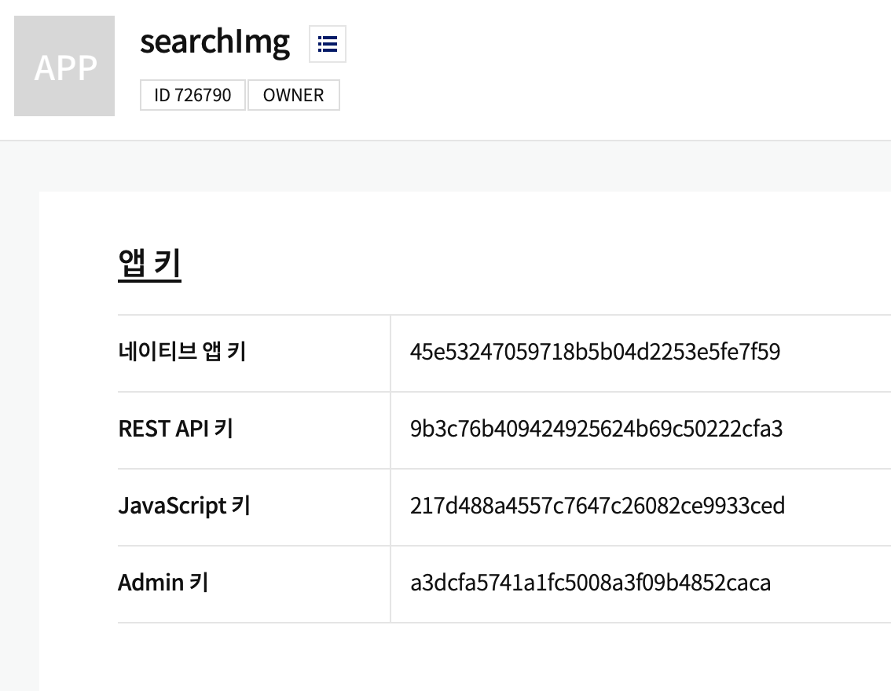
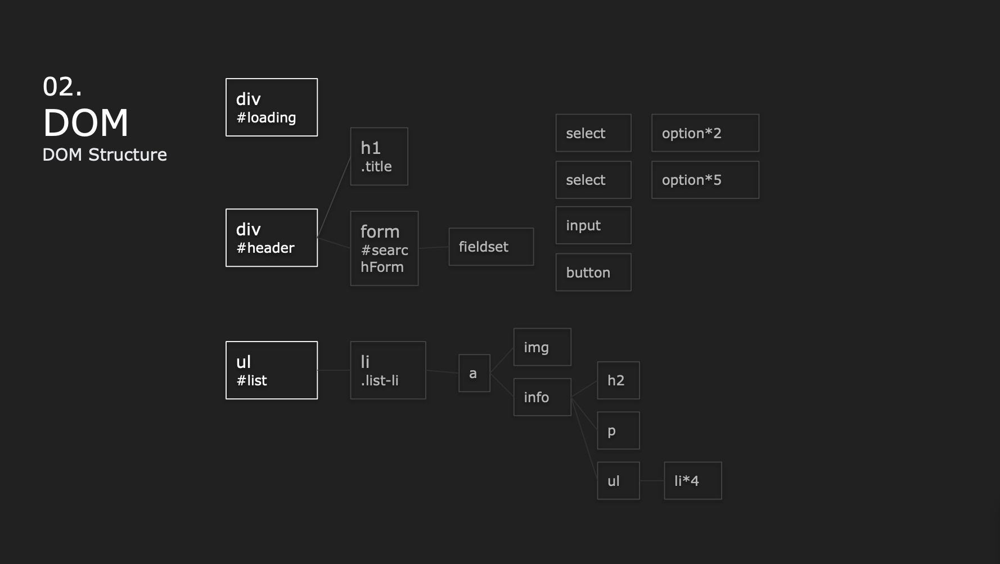
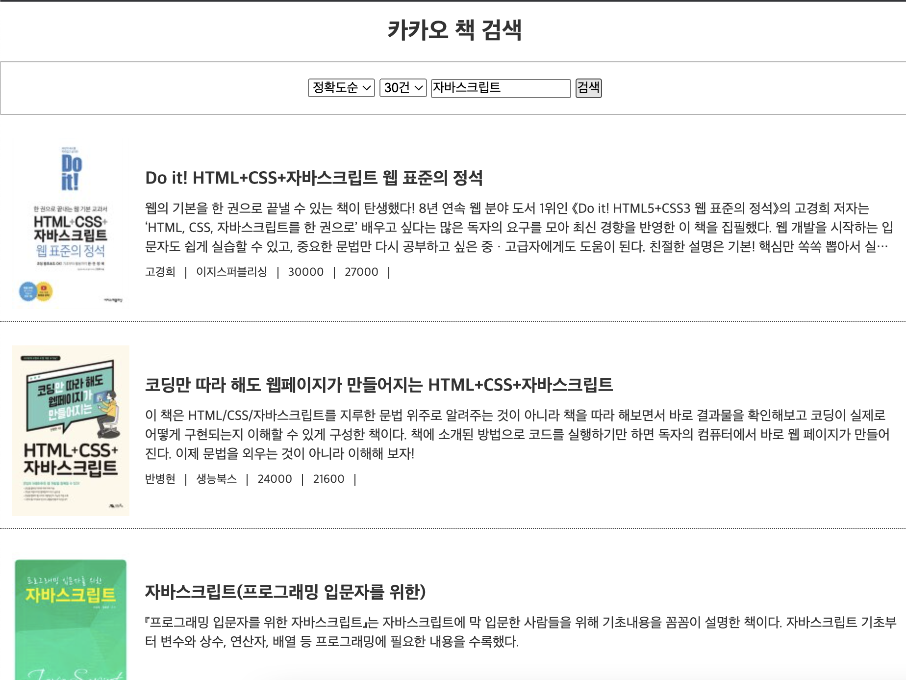
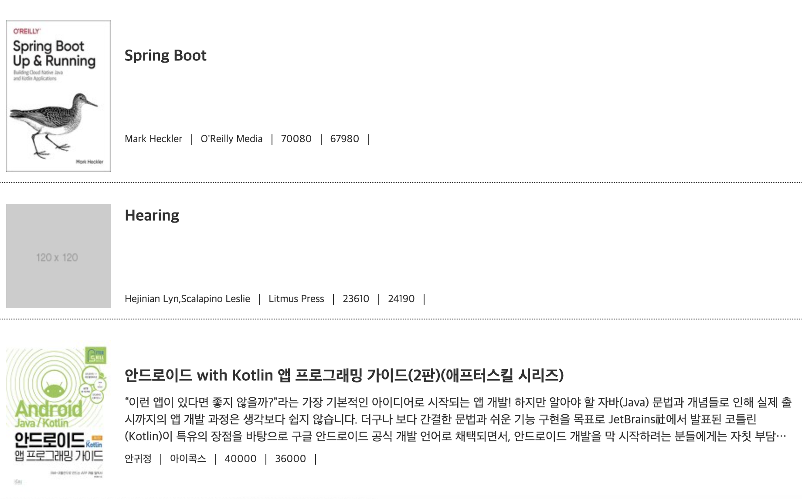
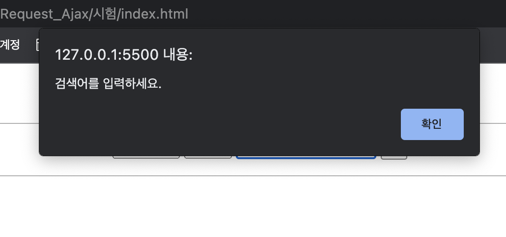

# 프로그래밍언어응용_보고서_정선미
> 2022.04.06

# 문항1


# 문항2


# 문항3



## HTML
```html
<!DOCTYPE html>
<html lang="ko">

<head>
  <meta charset="UTF-8">
  <meta http-equiv="X-UA-Compatible" content="IE=edge">
  <meta name="viewport" content="width=device-width, initial-scale=1.0">
  <title>카카오 책 검색</title>
  <link rel="stylesheet" href="./main.css">
</head>

<body>
  <div id="loading"></div>

  <div id="header">
    <h1>카카오 책 검색</h1>
    <form id="searchForm">
      <fieldset>
        <select name="sort" id="sort">
          <option value="accuracy">정확도순</option><!--기본값-->
          <option value="latest">발간일순</option>
        </select>
        <select name="size" id="size">
          <option value="10">10건</option><!--기본값-->
          <option value="20">20건</option>
          <option value="30">30건</option>
          <option value="40">40건</option>
          <option value="50">50건</option>
        </select>
        <input type="search" id="query" placeholder="책을 검색해보세요!">
        <button type="submit">검색</button>
      </fieldset>
    </form>
  </div>

  <ul id="list">
  </ul>

  <script src="https://cdn.jsdelivr.net/npm/axios/dist/axios.min.js"></script>
  <script src="./main.js"></script>
</body>

</html>
```
## CSS
```css
* {
  margin: 0;
  padding: 0;
  box-sizing: border-box;
}

a {
  text-decoration: none;
  color: inherit;
}

body {
  background: #fff;
  color: #333
}

ul {
  list-style: none;
}

#loading {
  display: block;
  position: absolute;
  left: 50%;
  top: 50%;
  transform: translate(-50%, -50%);
  z-index: 99999;
  display: none;
  margin: 40px auto;
  width: 8px;
  height: 8px;
  background-color: rgba(62, 74, 249, 0.5);
  ;
  box-shadow: -14px 0px 0px rgb(119, 190, 232);
  border-radius: 50%;
  -webkit-animation: circle_classic 1s ease-in-out infinite alternate;
  -moz-animation: circle_classic 1s ease-in-out infinite alternate;
  animation: circle_classic 1s ease-in-out infinite alternate;
}

@-webkit-keyframes circle_classic {
  0% {
    opacity: 0.1;
    -webkit-transform: rotate(0deg) scale(0.5);
  }

  100% {
    opacity: 1;
    -webkit-transform: rotate(360deg) scale(1.2);
  }
}

@-moz-keyframes circle_classic {
  0% {
    opacity: 0.1;
    -moz-transform: rotate(0deg) scale(0.5);
  }

  100% {
    opacity: 1;
    -moz-transform: rotate(360deg) scale(1.2);
  }
}

@keyframes circle_classic {
  0% {
    opacity: 0.1;
    transform: rotate(0deg) scale(0.5);
  }

  100% {
    opacity: 1;
    transform: rotate(360deg) scale(1.2);
  }
}

#loading.active {
  display: block;
}

#header {
  margin-bottom: 12px
}

#header h1 {
  text-align: center;
  padding: 16px 0;
  font-size: 24px;
}

#searchForm fieldset {
  border: 1px solid rgb(0 0 0 / 0.3);
  text-align: center;
  padding: 16px 0;
}

#list>li {
  margin-bottom: 12px;
  padding: 12px;
  border-bottom: 1px dotted rgb(66, 66, 66)
}

#list li a {
  display: flex;
  align-items: center;
}

#list li a img {
  display: block;
  width: 120px;
  max-height: 174px;
  overflow: hidden;
  object-fit: cover;
  margin-right: 16px;
}

#list li a .info {
  width: calc(100% - 136px);
}

.info h2 {
  font-size: 18px;
  overflow: hidden;
  text-overflow: ellipsis;
  text-align: left;
  word-wrap: break-word;
  display: -webkit-box;
  -webkit-line-clamp: 1;
  -webkit-box-orient: vertical;
  margin: 0 0 10px;
}

.info p {
  font-size: 14px;
  line-height: 1.4;
  height: 4.2em;
  overflow: hidden;
  text-overflow: ellipsis;
  text-align: left;
  word-wrap: break-word;
  display: -webkit-box;
  -webkit-line-clamp: 3;
  -webkit-box-orient: vertical;
  margin-bottom: 10px;
}

.info .detail {
  display: flex;
  align-items: center;
}

.info .detail li {
  margin-right: 10px;
  padding-right: 10px;
  border-right: 1px solid #333;
  line-height: 1;
  font-size: 12px;
}
```
## JS
```js
/*
@Filename : main.js
@Author : Jeong Seon-mi
@Description : 카카오 책 검색 api 연결

  < 파일 구성 >
  - setting key, parameter
  - 검색폼의 submit 이벤트(신규검색)
  - 스크롤 이벤트(추가검색)
  - Ajax요청 후 결과를 화면에 HTML로 출력하는 함수

*/

/* setting key, parameter */
// kakao rest api key
const KAKAO_REST_KEY = '9b3c76b409424925624b69c50222cfa3';

// 페이지 번호
let currentPage = 1;

// 검색어
let queryKeyword = null;

// 마지막페이지인지 검사
let isEnd = false;

// 결과 문서 정렬 방식
let selectSort = 'accuracy';

// 한 페이지에 보여질 문서 수
let selectSize = 10;


/* 검색폼의 submit 이벤트(신규검색) */
document.querySelector('#searchForm').addEventListener('submit', e => {
  e.preventDefault();

  // 입력된 검색어를 가져온다.
  const queryField = document.querySelector('#query');
  queryKeyword = queryField.value.trim();

  // 검색어가 입력되지 않은 경우에 대한 예외처리
  if (!queryKeyword) {
    alert('검색어를 입력하세요.');
    queryField.focus();
    return;
  }

  // 선택된 셀렉트 박스 값을 가져온다.
  const sizeBox = document.querySelector('#size')
  const sizeBoxSelected = Number(sizeBox.options[sizeBox.selectedIndex].value);
  
  // 선택된 셀렉트 박스 값을 가져온다.
  const sortBox = document.querySelector('#sort')
  const sortBoxSelected = sortBox.options[sortBox.selectedIndex].value;
  
  // 신규검색
  currentPage = 1;
  selectSize = sizeBoxSelected;
  selectSort = sortBoxSelected;
  get_book_search();
})

/* 스크롤 이벤트(추가검색) */
window.addEventListener('scroll', e => {
  // 마지막 페이지이거나 이미 로딩바가 화면에 표시되고 있다면 처리 중단
  if (isEnd || document.querySelector('#loading').classList.contains('active')) {
    return ;
  }

  // 스크롤바의 Y좌표
  const scrollTop = window.scrollY;
  // 웹브라우저의 창 높이
  const windowHeight = window.screen.availHeight;
  // HTML 문서의 높이
  const documentHeight = document.body.scrollHeight;

  // 스크롤바의 반동 효과를 고려해서 scrollTop + windowHeight가 실제 화면 크기보다 커 질 수도 있다.
  if (scrollTop + windowHeight >= documentHeight) {
    // 2페이지 이후는 추가 검색
    currentPage++;
    get_book_search();
  }

});

/* Ajax요청 후 결과를 화면에 HTML로 출력하는 함수 */
async function get_book_search() {
  // 로딩바 객체
  const loading = document.querySelector('#loading');

  // 로딩바 화면에 표시하기
  loading.classList.add('active');

  // 검색 결과가 표시될 영역
  const list = document.querySelector('#list');

  // 1페이지에 대한 요청일 경우 기존에 표시되고 있던 검색결과가 있다면 삭제한다.
  if (currentPage == 1) {
    Array.from(list.querySelectorAll('.list-li')).forEach((v, i) => {
      list.removeChild(v);
    })
  }

  // 검색결과를 저장할 빈 변수
  let json = null;

  // 데이터 받아오기
  try {
    json = await axios.get(`https://dapi.kakao.com/v3/search/book`, {
      params: {
        query: queryKeyword,
        page: currentPage,
        sort : selectSort,
        size : selectSize,
      },
      headers: {
        Authorization: `KakaoAK ${KAKAO_REST_KEY}`
      }
    });
    // 응답 결과 확인
    console.log(json)
  } catch (e) {
    console.error(err);
    alert('요청을 처리하는데 실패했습니다.');
    return;
  } finally {
    // 로딩바 닫기
    loading.classList.remove('active');
  }
  if (json != null) {
    const { data } = json;

    // 다음 페이지를 요청할 수 있는지를 판단하기 위한 값.
    isEnd = data.meta.is_end;

    data.documents.map((v, i) => {
      // li-1dep 추가
      const listLi = document.createElement('li');
      listLi.classList.add('list-li')

      // link a 추가
      const a = document.createElement('a');
      a.setAttribute('href', v.url);
      a.setAttribute('target', '_blank');

      // 이미지 추가
      const img = document.createElement('img');
      if(v.thumbnail == ''){
        img.setAttribute('src', './img/noimg.jpeg');
      }else{
        img.setAttribute('src', v.thumbnail);
      }

      // info
      const info = document.createElement('div');
      info.classList.add('info')

      // 도서제목
      const title = document.createElement('h2');
      title.innerHTML = v.title;

      // 도서소개
      const contents = document.createElement('p');
      contents.innerHTML = v.contents;

      // 상세정보
      const detail = document.createElement('ul')
      detail.classList.add('detail')
      const detailLi1 = document.createElement('li') // 저자 authors
      detailLi1.innerHTML = v.authors;
      const detailLi2 = document.createElement('li') // 출판사 publisher
      detailLi2.innerHTML = v.publisher;
      const detailLi3 = document.createElement('li') // 정가 price
      // 판매가가 -1이 아닌 경우에 
      // 정가가 0일 경우 판매가를 정가로 처리
      if(v.sale_price !== -1){
        detailLi3.innerHTML = v.price == 0 ? v.sale_price : v.price;
      }else{
        detailLi3.innerHTML = v.price
      }
      
      const detailLi4 = document.createElement('li') // 판매가 sale_price
      // 판매가 -1 일 경우 정가와 동일하게 처리
      detailLi4.innerHTML = v.sale_price == -1 ? v.price : v.sale_price;
      

      detail.appendChild(detailLi1);
      detail.appendChild(detailLi2);
      detail.appendChild(detailLi3);
      detail.appendChild(detailLi4);

      info.appendChild(title);
      info.appendChild(contents);
      info.appendChild(detail);

      a.appendChild(img);
      a.appendChild(info);

      listLi.appendChild(a);
      list.appendChild(listLi);
    })
  }
}
```

