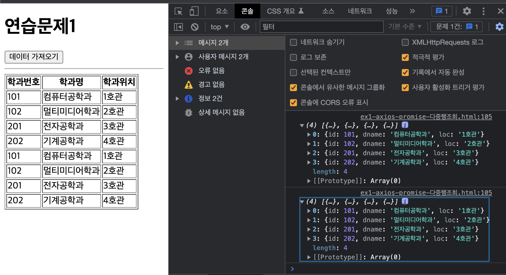
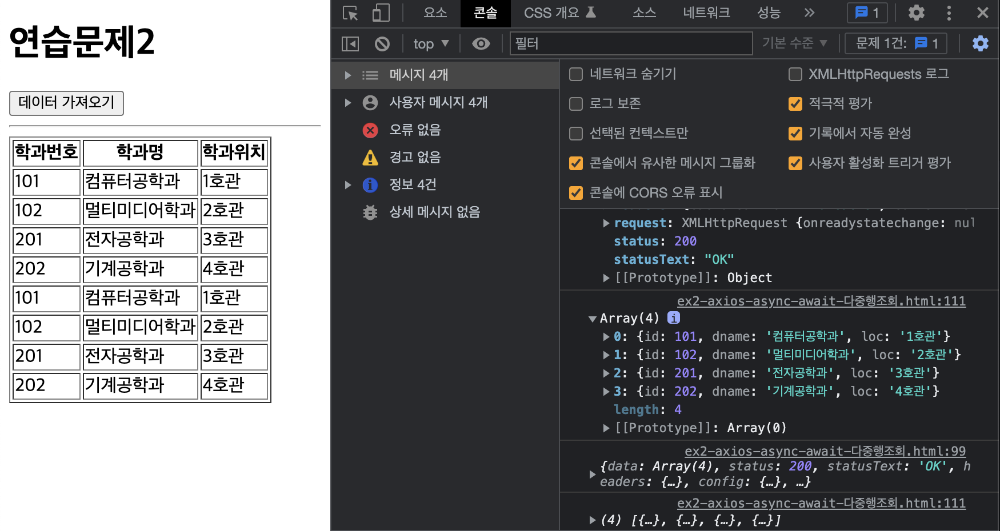

# axios 연습문제 정선미
> 20220404

## Q1 promise 방식으로 axios를 활용한 다중행 조회

```html
<!DOCTYPE html>
<html lang="en">
<head>
  <meta charset="UTF-8">
  <meta http-equiv="X-UA-Compatible" content="IE=edge">
  <meta name="viewport" content="width=device-width, initial-scale=1.0">
  <title>Document</title>
  <style>
    #loading {
      display: block;
      position: absolute;
      left: 50%;
      top: 50%;
      transform: translate(-50%, -50%);
      z-index: 99999;
      display: none;
      margin: 40px auto;
      width: 8px;
      height: 8px;
      background-color: rgba(62, 74, 249, 0.5);;
      box-shadow: -14px 0px 0px rgb(119, 190, 232);
      border-radius: 50%;
      -webkit-animation: circle_classic 1s ease-in-out infinite alternate;
      -moz-animation: circle_classic 1s ease-in-out infinite alternate;
      animation: circle_classic 1s ease-in-out infinite alternate;
    }
    @-webkit-keyframes circle_classic{
        0%{ opacity: 0.1; -webkit-transform: rotate(0deg) scale(0.5);}
      100%{opacity: 1; -webkit-transform: rotate(360deg) scale(1.2);}   
    }
    @-moz-keyframes circle_classic{
        0%{ opacity: 0.1; -moz-transform: rotate(0deg) scale(0.5);}
      100%{opacity: 1; -moz-transform: rotate(360deg) scale(1.2);}   
    }
    @keyframes circle_classic{
        0%{ opacity: 0.1; transform: rotate(0deg) scale(0.5);}
      100%{opacity: 1; transform: rotate(360deg) scale(1.2);}   
    }
    #loading.active {
      display: block;
    }

    dt {
      font-weight: bold;
      margin: 10px 0;
      font-size: 20px;
    }

    dt:before {
      content: '-';
      padding-right: 5px;
    }

    dd {
      margin-bottom: 30px;
      border-left: 5px #d5d5d5 solid;
      padding-left: 15px;
      font-size: 16px;
    }

    #dept-item {
      display: none;
    }
  </style>
</head>
<body>
  <div id="loading"></div>
  <h1>연습문제1</h1>
  <button id="btn" type="button">데이터 가져오기</button>
  <hr>
  <table border="1">
    <thead>
      <tr>
        <th>학과번호</th>
        <th>학과명</th>
        <th>학과위치</th>
      </tr>
    </thead>
    <tbody id="list-body"></tbody>
  </table>
  
  <script src="https://cdn.jsdelivr.net/npm/axios/dist/axios.min.js"></script>
  <script>
    document.querySelector('#btn').addEventListener('click',e=>{
      const loading = document.querySelector('#loading');
      loading.classList.add('active');
      
      axios
        .get(`http://localhost:3000/department`)

        .then(({data}) =>{
          console.log(data);

          const listBody = document.querySelector('#list-body');
          data.map((v,i)=>{
            const tr = document.createElement('tr');
            const td1 = document.createElement('td');
            td1.innerHTML = v.id;
            const td2 = document.createElement('td');
            td2.innerHTML = v.dname;
            const td3 = document.createElement('td');
            td3.innerHTML = v.loc;

            tr.appendChild(td1);
            tr.appendChild(td2);
            tr.appendChild(td3);
            
            listBody.appendChild(tr);
          })
        })
        .catch((error)=>{
          console.error(error);
          console.error(error.response.status);
          console.error(error.response.statusText);
          console.error(error.response.data);
          alert(error.response.statusText);
        })
        .finally(()=>{
          loading.classList.remove('active');
        })
    })

  </script>
</body>
</html>
```



## Q2 async~await 방식으로 axios를 활용한 다중행 조회

```html
<!DOCTYPE html>
<html lang="en">
<head>
  <meta charset="UTF-8">
  <meta http-equiv="X-UA-Compatible" content="IE=edge">
  <meta name="viewport" content="width=device-width, initial-scale=1.0">
  <title>Document</title>
  <style>
    #loading {
      display: block;
      position: absolute;
      left: 50%;
      top: 50%;
      transform: translate(-50%, -50%);
      z-index: 99999;
      display: none;
      margin: 40px auto;
      width: 8px;
      height: 8px;
      background-color: rgba(62, 74, 249, 0.5);;
      box-shadow: -14px 0px 0px rgb(119, 190, 232);
      border-radius: 50%;
      -webkit-animation: circle_classic 1s ease-in-out infinite alternate;
      -moz-animation: circle_classic 1s ease-in-out infinite alternate;
      animation: circle_classic 1s ease-in-out infinite alternate;
    }
    @-webkit-keyframes circle_classic{
        0%{ opacity: 0.1; -webkit-transform: rotate(0deg) scale(0.5);}
      100%{opacity: 1; -webkit-transform: rotate(360deg) scale(1.2);}   
    }
    @-moz-keyframes circle_classic{
        0%{ opacity: 0.1; -moz-transform: rotate(0deg) scale(0.5);}
      100%{opacity: 1; -moz-transform: rotate(360deg) scale(1.2);}   
    }
    @keyframes circle_classic{
        0%{ opacity: 0.1; transform: rotate(0deg) scale(0.5);}
      100%{opacity: 1; transform: rotate(360deg) scale(1.2);}   
    }
    #loading.active {
      display: block;
    }

    dt {
      font-weight: bold;
      margin: 10px 0;
      font-size: 20px;
    }

    dt:before {
      content: '-';
      padding-right: 5px;
    }

    dd {
      margin-bottom: 30px;
      border-left: 5px #d5d5d5 solid;
      padding-left: 15px;
      font-size: 16px;
    }

    #dept-item {
      display: none;
    }

  </style>
</head>
<body>
  <div id="loading"></div>
  <h1>연습문제2</h1>
  <button id="btn" type="button">데이터 가져오기</button>
  <hr>
  <table border="1">
    <thead>
      <tr>
        <th>학과번호</th>
        <th>학과명</th>
        <th>학과위치</th>
      </tr>
    </thead>
    <tbody id="list-body"></tbody>
  </table>

  <script src="https://cdn.jsdelivr.net/npm/axios/dist/axios.min.js"></script>
  <script>
    document.querySelector('#btn').addEventListener('click',async(e)=>{
        
      const loading = document.querySelector('#loading');
      loading.classList.add('active');

      let json, data = null;
      
      try{
        json = await axios.get('http://localhost:3000/department/');
        console.log(json)
      } catch(e){
        console.error(e);
        console.error(e.response.status);
        console.error(e.response.statusText);
        alert(e.response.statusText);
      } finally{
        loading.classList.remove('active')
      }

      if( json.data !== null){
        const listBody = document.querySelector('#list-body');

        json.data.map((v,i)=>{
          const tr = document.createElement('tr');
          const td1 = document.createElement('td');
          td1.innerHTML = v.id;
          const td2 = document.createElement('td');
          td2.innerHTML = v.dname;
          const td3 = document.createElement('td');
          td3.innerHTML = v.loc;

          tr.appendChild(td1);
          tr.appendChild(td2);
          tr.appendChild(td3);
          
          listBody.appendChild(tr);
        })
      }

    })
    
  </script>
</body>
</html>
```

