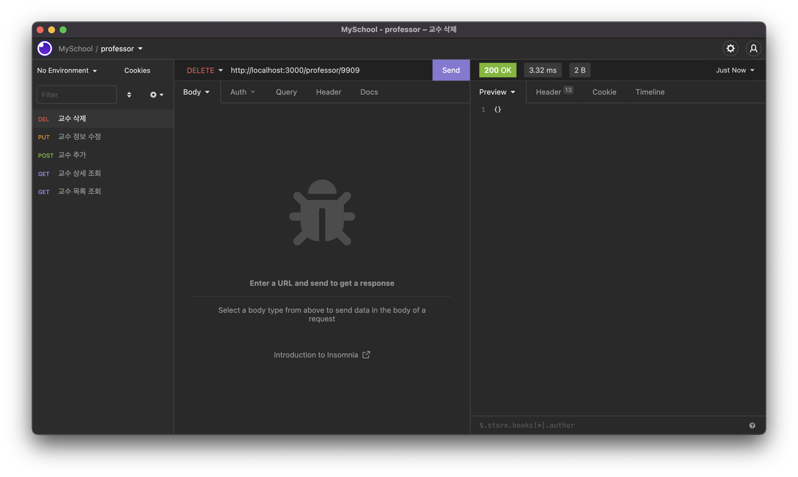
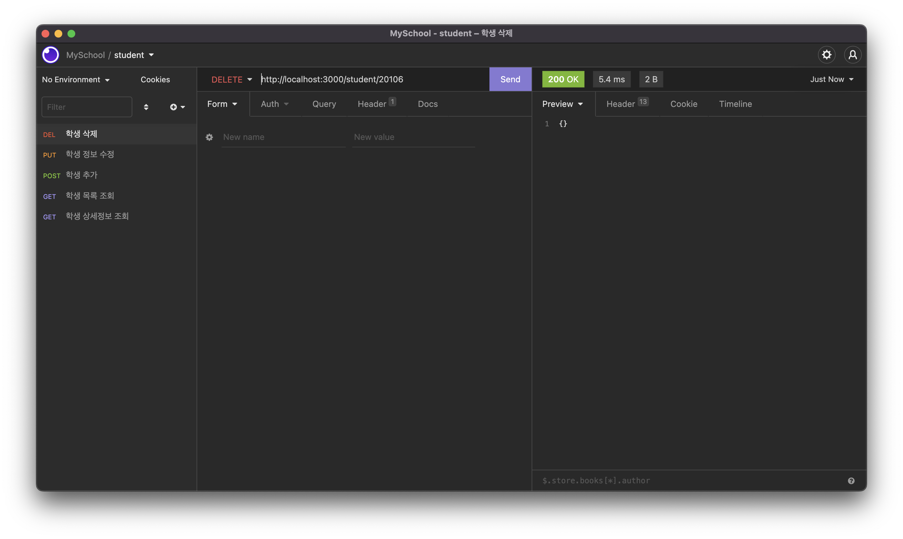

# 연습문제 정선미
> 2022-04-08

## 1. 교수에 대한 CRUD restful 테스트 화면
#### GET

#### POST

#### PUT

#### DELETE

## 2. 교수에 대한 CRUD 구현 웹 페이지
#### index

#### view

#### add

#### delete

## 3. 학생에 대하여 교수와 동일하게 구현
#### GET

#### POST

#### PUT

#### DELETE

#### index

#### view

#### add

#### delete
