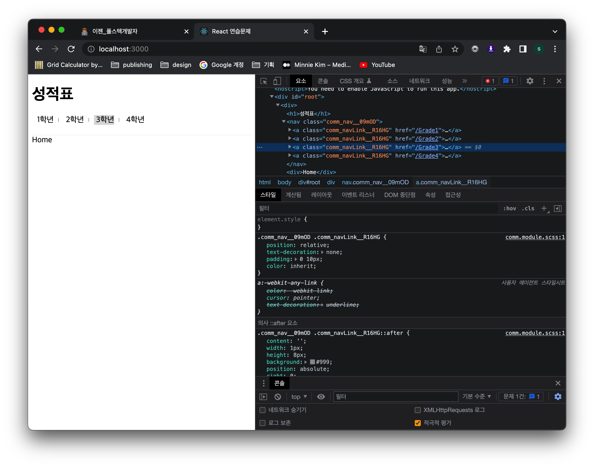
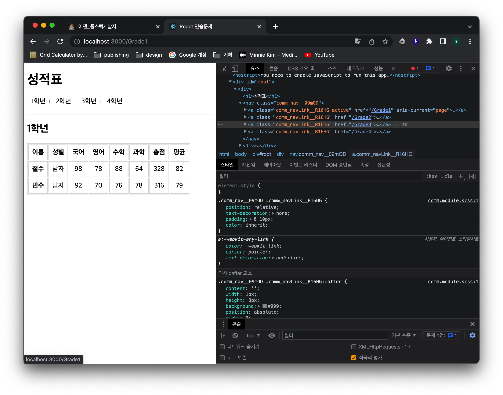
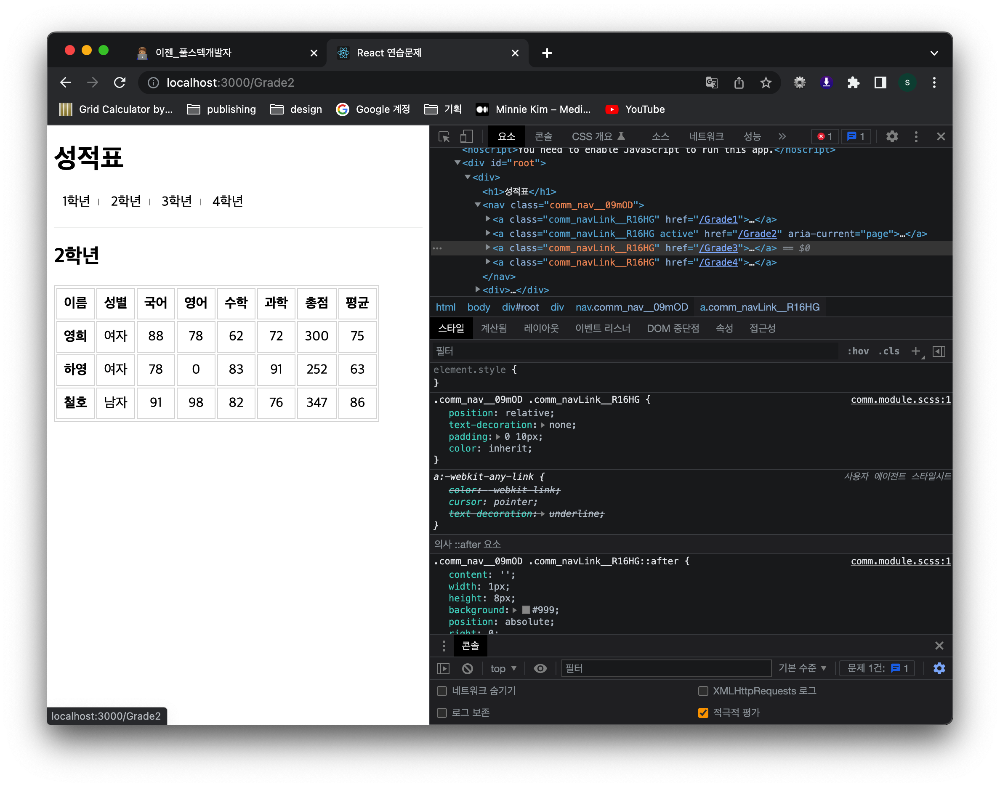
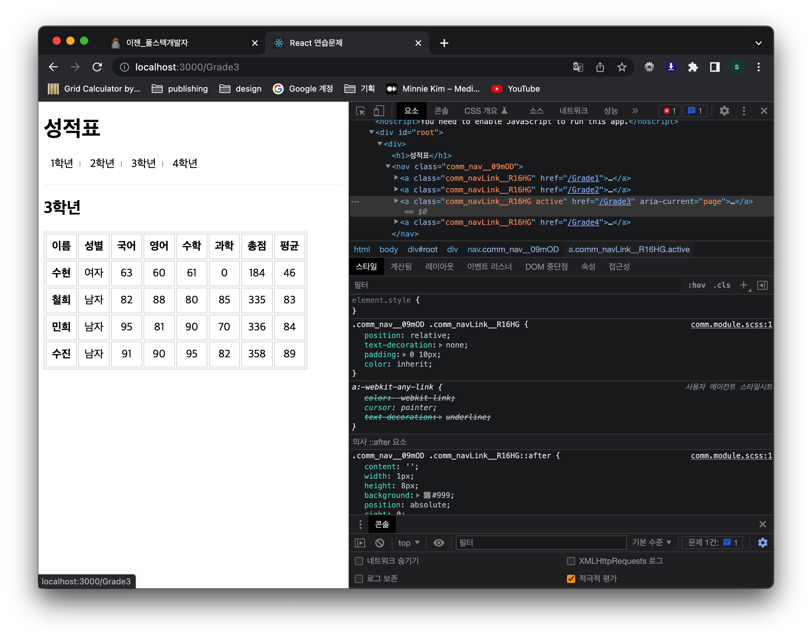
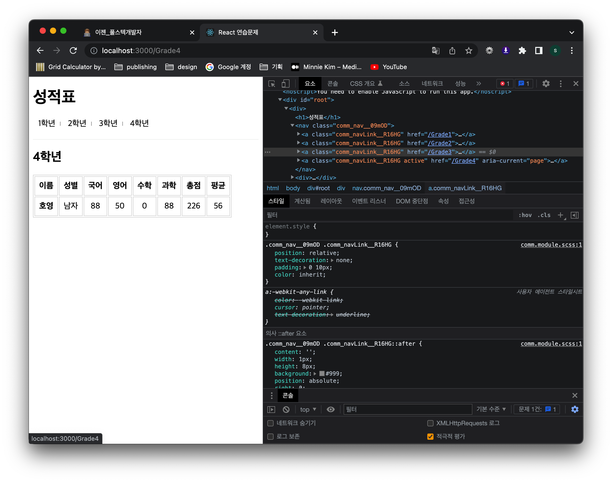

# 연습문제 4-1 정선미

> 20220427

## 결과이미지







## index.js

```javascript
import React from 'react';
import ReactDOM from 'react-dom/client';
import App from './App';
import { BrowserRouter } from 'react-router-dom';

const root = ReactDOM.createRoot(document.getElementById('root'));
root.render(
  <React.StrictMode>
    <BrowserRouter>
      <App />
    </BrowserRouter>
  </React.StrictMode>,
);
```

## App.js

```javascript
import { Routes, Route, NavLink } from 'react-router-dom';
import GradeData from './GradeData';
import Home from './pages/Home';
import Grade1 from './pages/Grade1';
import Grade2 from './pages/Grade2';
import Grade3 from './pages/Grade3';
import Grade4 from './pages/Grade4';
import comm from './assets/scss/comm.module.scss';

import Meta from './components/Meta';

function App() {
  const dataKeys = Object.keys(GradeData);

  return (
    <div>
      <Meta />
      <h1>성적표</h1>
      <nav className={comm.nav}>
        {dataKeys.map((item, index) => {
          return (
            <NavLink className={comm.navLink} key={index} to={`/Grade${index + 1}`}>
              {' '}
              {item}
            </NavLink>
          );
        })}
      </nav>
      <Routes>
        <Route path="/*" element={<Home />} />
        <Route path="/Grade1" element={<Grade1 items={GradeData[dataKeys[0]]} />} />
        <Route path="/Grade2" element={<Grade2 items={GradeData[dataKeys[1]]} />} />
        <Route path="/Grade3" element={<Grade3 items={GradeData[dataKeys[2]]} />} />
        <Route path="/Grade4" element={<Grade4 items={GradeData[dataKeys[3]]} />} />
      </Routes>
    </div>
  );
}

export default App;
```

## pages > Grade1.js

```javascript
import React from 'react';
import GradeItem from '../components/GradeItem';
import TableHead from '../components/TableHead';

const Grade1 = props => {
  return (
    <div>
      <h2>1학년</h2>
      <table>
        <thead>
          <TableHead />
        </thead>
        <tbody>
          {props.items.map((item, index) => {
            return (
              <GradeItem
                key={index}
                sname={item.이름}
                gender={item.성별}
                kor={item.국어}
                eng={item.영어}
                mat={item.수학}
                sci={item.과학}
              />
            );
          })}
        </tbody>
      </table>
    </div>
  );
};

export default Grade1;
```

## pages > Grade2.js

```javascript
import React from 'react';
import GradeItem from '../components/GradeItem';
import TableHead from '../components/TableHead';

const Grade2 = props => {
  return (
    <div>
      <h2>2학년</h2>
      <table>
        <thead>
          <TableHead />
        </thead>
        <tbody>
          {props.items.map((item, index) => {
            return (
              <GradeItem
                key={index}
                sname={item.이름}
                gender={item.성별}
                kor={item.국어}
                eng={item.영어}
                mat={item.수학}
                sci={item.과학}
              />
            );
          })}
        </tbody>
      </table>
    </div>
  );
};

export default Grade2;
```

## pages > Grade3.js

```javascript
import React from 'react';
import GradeItem from '../components/GradeItem';
import TableHead from '../components/TableHead';

const Grade3 = props => {
  return (
    <div>
      <h2>3학년</h2>
      <table>
        <thead>
          <TableHead />
        </thead>
        <tbody>
          {props.items.map((item, index) => {
            // console.log(item);
            return (
              <GradeItem
                key={index}
                sname={item.이름}
                gender={item.성별}
                kor={item.국어}
                eng={item.영어}
                mat={item.수학}
                sci={item.과학}
              />
            );
          })}
        </tbody>
      </table>
    </div>
  );
};

export default Grade3;
```

## pages > Grade4.js

```javascript
import React from 'react';
import GradeItem from '../components/GradeItem';
import TableHead from '../components/TableHead';

const Grade4 = props => {
  return (
    <div>
      <h2>4학년</h2>
      <table>
        <thead>
          <TableHead />
        </thead>
        <tbody>
          {props.items.map((item, index) => {
            // console.log(item);
            return (
              <GradeItem
                key={index}
                sname={item.이름}
                gender={item.성별}
                kor={item.국어}
                eng={item.영어}
                mat={item.수학}
                sci={item.과학}
              />
            );
          })}
        </tbody>
      </table>
    </div>
  );
};

export default Grade4;
```

## components > GradeItem.js

```javascript
import React from 'react';
import PropTypes from 'prop-types';

const GradeItem = ({ sname, gender, kor, eng, mat, sci }) => {
  let sum = parseInt(kor + eng + mat + sci, 10);
  let avg = parseInt((kor + eng + mat + sci) / 4, 10);

  return (
    <tr>
      <td>{sname}</td>
      <td>{gender}</td>
      <td>{kor}</td>
      <td>{eng}</td>
      <td>{mat}</td>
      <td>{sci}</td>
      <td>{sum}</td>
      <td>{avg}</td>
    </tr>
  );
};

GradeItem.propTypes = {
  sname: PropTypes.string,
  gender: PropTypes.string,
  kor: PropTypes.number,
  eng: PropTypes.number,
  mat: PropTypes.number,
  sci: PropTypes.number,
};
GradeItem.defaultProps = {
  kor: 0,
  eng: 0,
  mat: 0,
  sci: 0,
};

export default GradeItem;
```

## components > Meta.js

```javascript
import React from 'react';

import { Helmet } from 'react-helmet';
import favicon from '../assets/img/favicon.ico';

const Meta = props => {
  return (
    <Helmet>
      <meta charSet="utf-8" />
      <title>{props.title}</title>
      {/* SEO 태그 */}
      <meta name="description" content={props.description} />
      <meta name="keywords" content={props.keywords} />
      <meta name="author" content={props.author} />
      <meta property="og:type" content="website" />
      <meta property="og:title" content={props.title} />
      <meta property="og:description" content={props.description} />
      <meta property="og:image" content={props.image} />
      <meta property="og:url" content={props.url} />

      <link rel="shortcut icon" href={props.image} type="image/png" />
      <link rel="icon" href={props.image} type="image/png" />

      {/* 추가적으로 적용해야할 외부 js나 css도 여기서 명시할 수 있다. */}
    </Helmet>
  );
};

Meta.defaultProps = {
  title: 'React 연습문제',
  description: 'React.js 연습문제',
  keywords: 'react',
  author: '정선미',
  image: favicon,
  url: window.location.href,
};

export default Meta;
```

## components > TableHead.js

```javascript
import React from 'react';

const TableHead = () => {
  return (
    <tr>
      <th>이름</th>
      <th>성별</th>
      <th>국어</th>
      <th>영어</th>
      <th>수학</th>
      <th>과학</th>
      <th>총점</th>
      <th>평균</th>
    </tr>
  );
};

export default TableHead;
```
